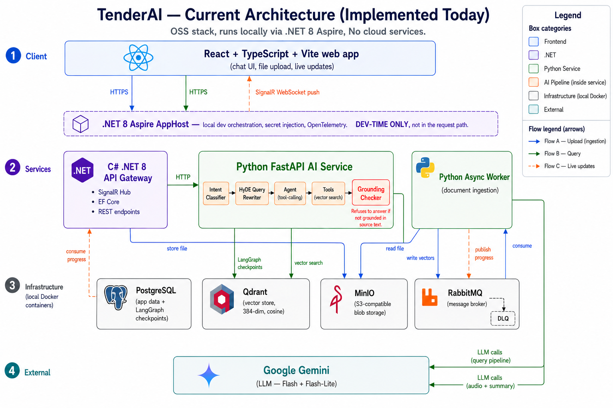
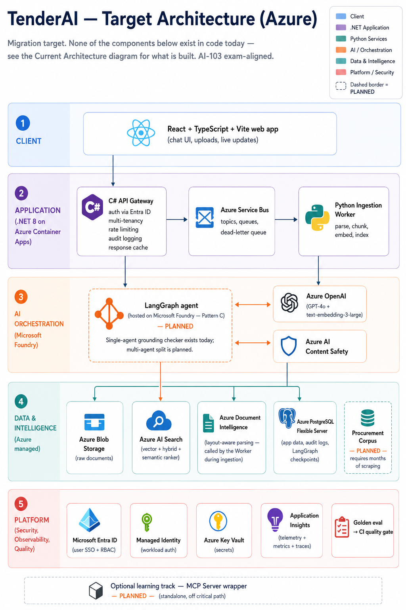

# 🏢 Prism — Document Intelligence Agent for Public Prisms


Prism analyzes complex public-procurement documents (RFPs, prisms, contracts) and answers questions about them **without hallucinating**. It is built on a **Corrective RAG (CRAG)** pipeline with an explicit grounding checker: if a claim cannot be verified against the retrieved source chunks, the system declines or flags it rather than inventing a plausible answer.

The whole distributed system runs locally via **.NET 8 Aspire**, which handles container orchestration, secret injection, and unified telemetry.

> **Honesty note for reviewers:** this README describes what is *actually implemented today*. Aspirational components are clearly separated under **Roadmap**. For a full current-vs-target breakdown including known gaps, see [`AI_HANDOFF.md`](AI_HANDOFF.md) §9.

---


*(This diagram represents the currently implemented, asynchronous event-driven workflow.)*

## ✨ What's Built (Current State)

* **🛡️ Grounding Checker (the core differentiator).** A dedicated LangGraph node audits the agent's answer against retrieved source chunks. If a fact isn't supported, the UI shows a caveat banner instead of presenting it as confirmed. This is the system's primary proof-of-value: **correct refusal over confident hallucination.**
* **⚡ Event-Driven Ingestion.** Uploads are streamed to **MinIO**; **RabbitMQ** triggers background extraction and embedding; the React UI gets real-time progress via **SignalR**.
* **🎯 Intent Classification + HyDE.** A fast LLM classifies user intent before any costly search, then rewrites the question into dense keywords to improve vector retrieval.
* **🧠 Persistent Conversation Memory.** State and tool-call history are persisted via LangGraph's PostgreSQL checkpointer (keyed by chat/thread id).
* **⚙️ Fault-Tolerant Workers.** RabbitMQ Dead Letter Queue handling. Terminal errors (e.g. corrupted PDFs) are isolated and surfaced to the UI; transient errors (e.g. network blips) are requeued with a delay.
* **🎙️ Audio-to-Text Input.** Voice questions are transcribed via Gemini before entering the pipeline. *(Basic transcription only — no speaker diarization or PII redaction.)*
* **📊 Golden Evaluation Set.** A 20-question regression gate (`golden_eval.json`) covering factual retrieval, table extraction, reasoning, and grounding-negative refusal cases.

---

## 🏗️ Current Stack

| Layer | Technology | Purpose |
| :--- | :--- | :--- |
| **Orchestrator (local)** | `.NET 8 Aspire` | Manages containers, networking, secret injection |
| **Frontend** | `React`, `TypeScript`, `Vite` | Real-time UI, Markdown rendering, source citations |
| **API Gateway** | `C# .NET 8`, `SignalR` | Routing, WebSocket push, EF Core persistence |
| **AI Service** | `Python 3.13`, `FastAPI`, `uv` | LangGraph CRAG state graph |
| **Worker** | `Python 3.13` async | Document ingestion + embedding consumer |
| **LLM** | `Google Gemini` | Tool-calling (Flash) + classification (Flash-Lite) |
| **Relational / Memory** | `PostgreSQL` | App data + LangGraph checkpoints |
| **Vector Store** | `Qdrant` | Cosine search, `bge-small-en-v1.5` (384-dim) |
| **Blob Storage** | `MinIO` | S3-compatible document storage |
| **Message Broker** | `RabbitMQ` | Decouples upload from embedding; custom exchanges + DLQ |

---

## 🚀 Getting Started

### Prerequisites
* **Docker Desktop** (for Postgres, Qdrant, MinIO, RabbitMQ)
* **.NET 8.0 SDK**
* **Python 3.13** (with the `uv` package manager)
* **Node.js** (v18+)

### 🔐 Secrets (via Aspire user-secrets, not `.env`)
From the `Prism.AppHost` directory:

```bash
cd Prism.AppHost

dotnet user-secrets set "GoogleApiKey" "your-gemini-api-key"
dotnet user-secrets set "Parameters:rabbitmquser" "admin"
dotnet user-secrets set "Parameters:rabbitmqpass" "your-secure-password"
dotnet user-secrets set "Parameters:MinioUser" "admin"
dotnet user-secrets set "Parameters:MinioSecret" "your-secure-password"
dotnet user-secrets set "Parameters:QdrantApiKey" "your-secure-qdrant-key"
```

### 🥇 Optional: LangSmith Tracing
Tracing is *supported but not enforced by code*. To enable it, add a `.env` in `Prism.PythonService`:

```env
LANGSMITH_TRACING=true
LANGSMITH_ENDPOINT=https://api.smith.langchain.com
LANGSMITH_API_KEY=your_langsmith_key
LANGSMITH_PROJECT=Prism
```

---

## 🔮 Roadmap (Not Yet Built)

These are the target enterprise/Azure components. **None of these are implemented today** — they are listed here so the README never overstates the codebase.

- [ ] **Azure migration** — Azure OpenAI (LLM), Azure AI Search (vector + hybrid), Document Intelligence (layout-aware chunking), Blob Storage, Service Bus, Key Vault, Entra ID, Container Apps deploy.
- [ ] **Structure-aware chunking** — replace fixed-size chunking; preserve tables (critical for the table-extraction eval cases).
- [ ] **Bid Intelligence Brief** — verdict + reasons + hidden requirements + questions, derived from the uploaded prism.
- [ ] **Compliance Matrix** — requirements rendered as a cited pass/fail checklist.
- [ ] **Redis response caching** — container is provisioned by Aspire, but no caching logic exists yet.
- [ ] **Multi-tenancy + RBAC** — `tenant_id` scaffold then Entra ID enforcement.
- [ ] **Test suite + automated eval harness** in CI.
- [ ] **gRPC** low-latency path (bypass RabbitMQ for already-open documents).


*(This diagram represents the future roadmap.)*
---
