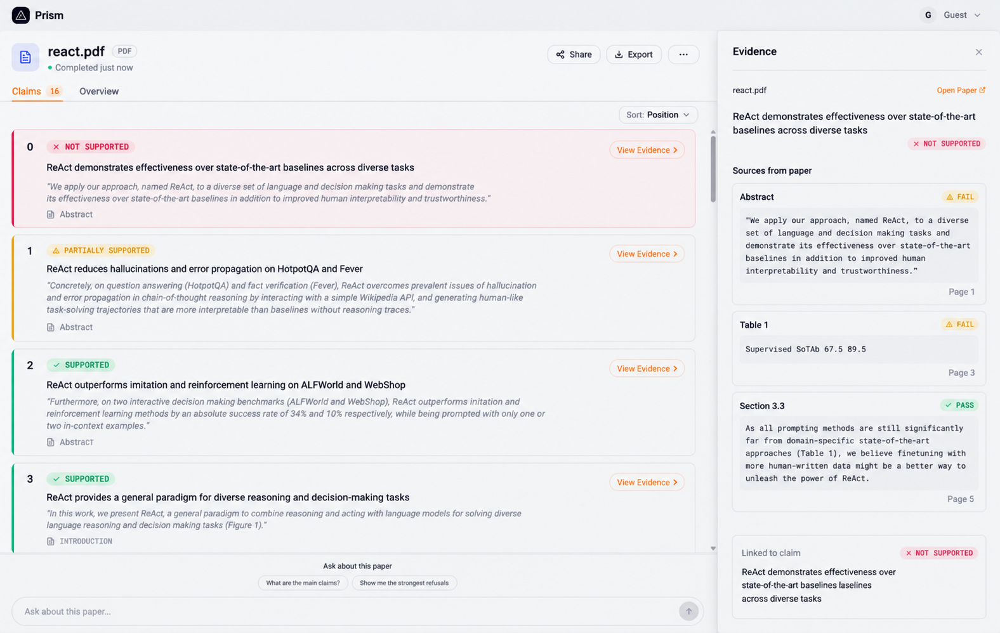
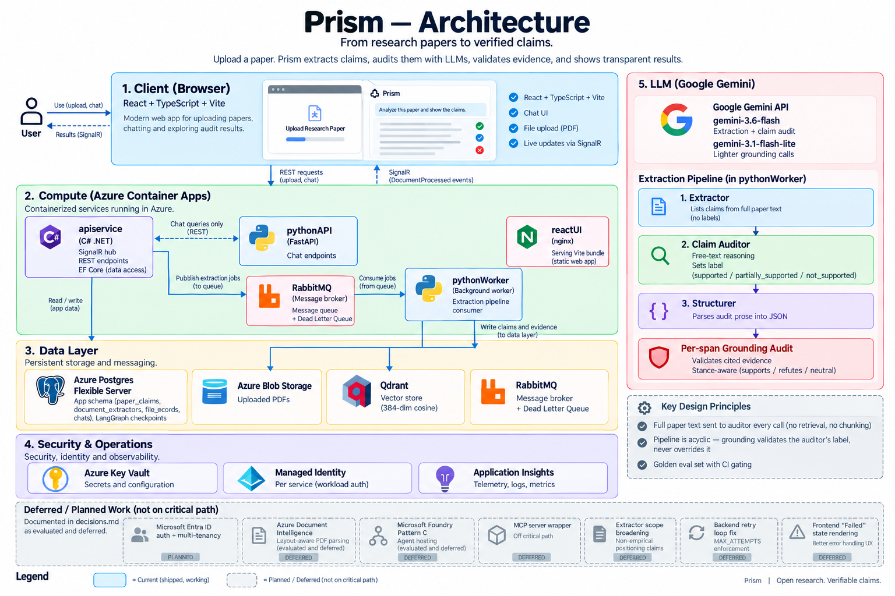

# Prism

> **Autonomous Empirical Claim-Auditing Engine for Research Papers**

Prism extracts empirical claims from academic papers and rigorously audits whether each claim is supported by evidence in that same paper. Unlike literature discovery tools (Elicit, Consensus, Scite) that find and summarize across papers, Prism performs a peer-reviewer's core job: auditing a single paper's headline findings against its own data and text.

## Live Demo

**[Prism Live Demo](https://prism-ai-reactui.nicesky-c6f0b846.centralindia.azurecontainerapps.io/)**

Try Prism directly in your browser using **Guest Access** — no account required.

> **Google Sign-In:** UI is present but not yet functional. Use Guest Access to try the product today.

Guest sessions are currently available for demo use only, making it easy for reviewers to try the product without creating an account.

Upload a paper. Prism extracts claims, audits each claim against the paper's own evidence, and presents the results in a claim-support matrix.



## Evaluation

Prism's core engineering bet is correct refusal: vetoing any assessment not supported by the paper's own text.

**Current Eval: 11/14 refusal-family (79%)**
- 5 by_label (the auditor explicitly reasoned to a refusal-family verdict)
- 6 by_omission (the claim was safely dropped before being falsely affirmed)
- 0 by_grounding_reject (the downstream grounding checker vetoed an affirmed claim)
- **3/14 (21%) strict-label** — of the 5 explicit labels, only 3 matched the exact expected tier; the other 2 were refusal-family-correct but landed on the wrong tier (e.g. `not_supported` where `partially_supported` was expected)
- 11/23 (48%) positive hits (floor: 10)
- 0/23 (0%) false rejection rate

A `by_label` refusal means the auditor read the paper and reasoned to a refusal — that's the product working. A `by_omission` refusal means the extractor dropped the claim before it was ever audited, so the user never sees it flagged. Converting omissions into visible, correctly-tiered refusals is the current work.

Eval runs are transient-failure-aware: infrastructure errors during grounding return `SKIPPED` rather than defaulting to `FAIL`, so a rate-limit blip doesn't masquerade as a false rejection or deflate the score.

## How it works

The pipeline is orchestrated asynchronously via RabbitMQ and broken into specific stages to avoid context collapse. First, a Python worker extracts empirical and methodological positioning claims from the full text. Next, a claim auditor (Gemini 3.6 Flash) evaluates each claim individually against the full paper text to assign a label (supported, partially supported, or not supported) — tightened to require evidence from experimental results, data, or proofs, not just a verbatim quote from the Abstract or Introduction. Finally, a grounding checker validates the auditor's exact quote spans using semantic matching (RapidFuzz) and a secondary LLM judge (Groq/LiteLLM), adjusting the rubric based on the claim's stance toward the claim (supports, refutes, or neutral). The pipeline is strictly acyclic: the grounder validates the auditor, but never overrides its label.

## Architecture



## Tech Stack

| Layer | Technologies |
|---|---|
| **Orchestration** | .NET Aspire 13.4 |
| **API Gateway** | ASP.NET Core (.NET 10), EF Core 10 |
| **Worker & Agent** | Python 3.13 (`uv`), FastAPI, LangGraph |
| **LLMs** | Gemini 3.6 Flash, LiteLLM (Groq / Gemini Flash Lite) |
| **Vector & Search** | Qdrant 1.18 |
| **Data & Messaging**| PostgreSQL 18, RabbitMQ 4.3, MinIO |
| **Frontend** | React 19, TypeScript, Vite, Tailwind CSS |

## Quick Start (Local Dev)

**Prerequisites:** .NET 10 SDK, Docker Desktop, `uv`, Node.js 20+, Google Gemini API Key, Groq API Key.

1. Set keys in .NET user-secrets:
```powershell
cd Prism.AppHost
dotnet user-secrets set "Parameters:GoogleApiKey" "your_key"
dotnet user-secrets set "Parameters:GroqApiKey"   "your_key"
dotnet user-secrets set "Parameters:rabbitmquser" "admin"
dotnet user-secrets set "Parameters:rabbitmqpass" "any-strong-string"
dotnet user-secrets set "Parameters:QdrantApiKey" "any-strong-string"
```

2. Run the stack:
```powershell
dotnet run --project Prism.AppHost
```
This launches the Aspire Dashboard. The Web UI will be available at `http://localhost:7000`.

Hit a local-dev snag? Check the [Developer Runbook](docs/RUNBOOK.md) first — it covers the recurring ones (Postgres volume password drift, Gemini quota limits, dynamic Aspire ports, PowerShell curl escaping, eval fixture regeneration, common deploy failure modes).

## Deployment

Backend services deploy via `aspire deploy` — apiservice, pythonAPI, pythonWorker, messaging, storage, Postgres. Managed identities and Key Vault provisioned automatically; secrets reach containers as `secretref:` values, never plaintext env vars.

The React frontend uses `Prism.Web/deploy.ps1` — a hardened manual push that preflights nginx.conf, prunes Docker layers, builds with a unique tag, and verifies cache-control headers landed on the live URL. This exists because `aspire deploy` builds its own reactUI container that overwrites the custom nginx.conf. Root fix (`AppHost.cs` `PublishAsDockerFile`) tracked for v1.0.2.

Deploy secrets templated in `Prism.AppHost/.deploy.env.template`; `.deploy.env` gitignored. nginx listens on port 7000 to align with Azure Container Apps' probe.

Container App runs single revision mode — traffic auto-swaps on healthy deploys. Always verify actual running state with `az containerapp revision list --query "[?properties.active]"` after any deploy; `properties.template` shows *desired* config, not what's actually live.

## Architecture & Decisions

Prism's architecture and design choices are documented in detail:
* **[Decisions Log](docs/decisions.md)** — Append-only record of architecture, schema, and prompt design decisions.
* **[Developer Runbook](docs/RUNBOOK.md)** — Local dev gotchas, deployment failure modes, eval fixture regeneration.
* **[Pipeline Audit (2026-09-04)](docs/audit/pipeline_audit_2026-09-04.md)**
* **[Defects Audit (2026-09-04)](docs/audit/two_defects_2026-09-04.md)**
* **[Architecture Review (2026-09-05)](docs/audit/pipeline_architecture_review_2026-09-05.md)**
* **[Pending Bugs (2026-09-05)](docs/audit/upload_pending_bugs_2026-09-05.md)**

## License

Distributed under the MIT License. See [LICENSE](LICENSE).
