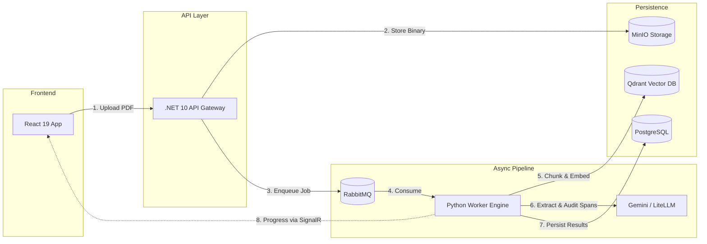

# Prism

> **Autonomous Empirical Claim-Auditing Engine for Research Papers**

Prism extracts empirical claims from academic papers and rigorously audits whether each claim is supported by evidence in that same paper. Unlike literature discovery tools (Elicit, Consensus, Scite) that *find and summarize* across papers, Prism performs the peer-reviewer's core job: **auditing a single paper's headline findings against its own data and text**.

---

## What It Produces

For every ingested research paper, Prism generates a **Paper Intelligence Brief**:

* **Verdict & Confidence** — High-level assessment (`Supported`, `Partially Supported`, `Not Supported`) grounded with concrete rationale.
* **Overstated Claims** — Flags assertions that overreach beyond what the experimental data actually demonstrates.
* **Questions to Scrutinize** — High-priority probing questions tailored for peer reviewers and critical readers.
* **Claim-Support Matrix** — Granular, claim-by-claim verification linking each empirical assertion to verified context spans in the text.

---

## Architecture

Prism is orchestrated locally via **.NET Aspire** and architected into two decoupled, resilient subsystems:

### 1. Async Ingestion & Grounding Pipeline
PDF uploads are staged in MinIO object storage and enqueued to RabbitMQ. A Python worker extracts claims, generates embeddings in Qdrant, verifies text spans using semantic matching (RapidFuzz) and multi-model LLM audits, and writes results to PostgreSQL. Real-time progress is streamed to the React UI over SignalR.


```mermaid
flowchart LR
    subgraph Client [Frontend]
        UI[React 19 App]
    end

    subgraph Gateway [API Layer]
        GW[.NET 10 API Gateway]
    end

    subgraph Processing [Async Pipeline]
        MQ[(RabbitMQ)]
        Worker[Python Worker Engine]
        LLM[Gemini / LiteLLM]
    end

    subgraph Storage [Persistence]
        MinIO[(MinIO Storage)]
        Qdrant[(Qdrant Vector DB)]
        PG[(PostgreSQL)]
    end

    UI -->|1. Upload PDF| GW
    GW -->|2. Store Binary| MinIO
    GW -->|3. Enqueue Job| MQ
    MQ -->|4. Consume| Worker
    Worker -->|5. Chunk & Embed| Qdrant
    Worker -->|6. Extract & Audit Spans| LLM
    Worker -->|7. Persist Results| PG
    Worker -.->|8. Progress via SignalR| UI
```

### 2. Conversational Paper Chat
Interactive queries run through a LangGraph agent served by FastAPI. Retrieval executes concurrently across PostgreSQL (structured claims) and Qdrant (dense vector chunks), streaming grounded answers with clickable claim citations via Server-Sent Events (SSE).

---

## Tech Stack

| Layer | Technologies | Role / Notes |
|---|---|---|
| **Orchestration** | .NET Aspire 13.4 | Local multi-service orchestration, telemetry & discovery |
| **API Gateway** | ASP.NET Core (.NET 10), EF Core 10 | Gateway, SignalR hubs, authentication, and ingestion staging |
| **Worker & Agent** | Python 3.13 (`uv`), FastAPI, LangGraph | Three-call extraction pipeline, span grounder, and chat agent |
| **LLM Tiering** | Gemini 3.6 Flash, LiteLLM (Groq / Gemini Flash Lite) | Tiered extraction and multi-provider fallback audit chain |
| **Vector & Search** | Qdrant 1.18 | Dense embedding retrieval for section context and chat |
| **Data & Messaging**| PostgreSQL 18, RabbitMQ 4.3, MinIO | Relational persistence, distributed task queue, PDF storage |
| **Frontend** | React 19, TypeScript, Vite, Tailwind CSS | 3-panel claim matrix, evidence drawer, SSE streaming chat |

---

## Quick Start

### Prerequisites
* [.NET 10 SDK](https://dotnet.microsoft.com/download)
* [Docker Desktop](https://www.docker.com/) (Postgres, Qdrant, RabbitMQ, MinIO)
* [`uv`](https://docs.astral.sh/uv/) (Python package manager)
* [Node.js 20+](https://nodejs.org/)
* [Google Gemini API Key](https://aistudio.google.com/apikey)

### 1. Setup & Secrets
```powershell
git clone https://github.com/i-mouse/prism.git
cd prism
.\setup.ps1
```

Configure your Gemini API key via .NET user secrets:
```powershell
cd Prism.AppHost
dotnet user-secrets set "GoogleApiKey" "<your-api-key>"
cd ..
```

### 2. Launch Development Stack
```powershell
.\dev.ps1
```

- **Aspire Dashboard:** Opens automatically at launch (inspects all dynamic ports, logs, and telemetry).
- **Web UI:** Navigate to `http://localhost:7000` and upload any paper PDF to begin an audit.

---

## Evaluation Harness

Prism uses an automated evaluation harness with curated golden test sets to measure claim grounding accuracy and correct-refusal rates on negative cases:

```powershell
# Run evaluation harness against local database
cd Prism.PythonService
uv run python -m eval.matrix_runner --source db

# Run against committed golden fixtures
uv run python -m eval.matrix_runner --source fixture
```

CI runs fixture evaluations on pull requests to enforce zero regression on refusal and grounding baselines.

---

## Repository Structure

```
prism/
├── Prism.AppHost/           # .NET Aspire orchestration and service definitions
├── Prism.ApiService/        # C# API gateway, EF Core schema, SignalR hubs
├── Prism.PythonService/     # Python worker, extraction engine, LangGraph chat agent
├── Prism.Web/               # React 19 frontend (Claim Matrix workspace, SSE chat)
├── Prism.ServiceDefaults/   # Cross-cutting telemetry and health checks
└── docs/                    # Architecture decisions, runbooks, and eval specs
```

---

## Documentation

* **[Product Brief](docs/PRODUCT_BRIEF.md)** — Core product vision, target persona, and value proposition.
* **[Decisions Log](docs/decisions.md)** — Append-only record of architecture and schema decisions.
* **[Developer Runbook](docs/RUNBOOK.md)** — Troubleshooting, Docker container gotchas, and debugging tips.
* **[Evaluation Design](docs/eval-harness-design.md)** — Methodology and metrics for grounding benchmark.

---

## Roadmap

- [x] **Core Claim-Support Matrix:** Automated empirical claim extraction with 3-tier verdict rubric.
- [x] **Real-time Ingestion Tracking:** Multi-stage SignalR progress telemetry and interactive activity view.
- [x] **Paper-Scoped Chat:** LangGraph conversational agent with dual-store retrieval and citation streaming.
- [ ] **Multi-Paper Synthesis:** Cross-paper retrieval, comparative claim auditing, and shared literature views.
- [ ] **Web-Grounded Fact Checking:** Tool routing to external search providers for verifying external citations.
- [ ] **Layout-Aware Ingestion:** Document Intelligence integration for structure-aware tabular extraction.

---

## License

Distributed under the MIT License. See [LICENSE](LICENSE).
