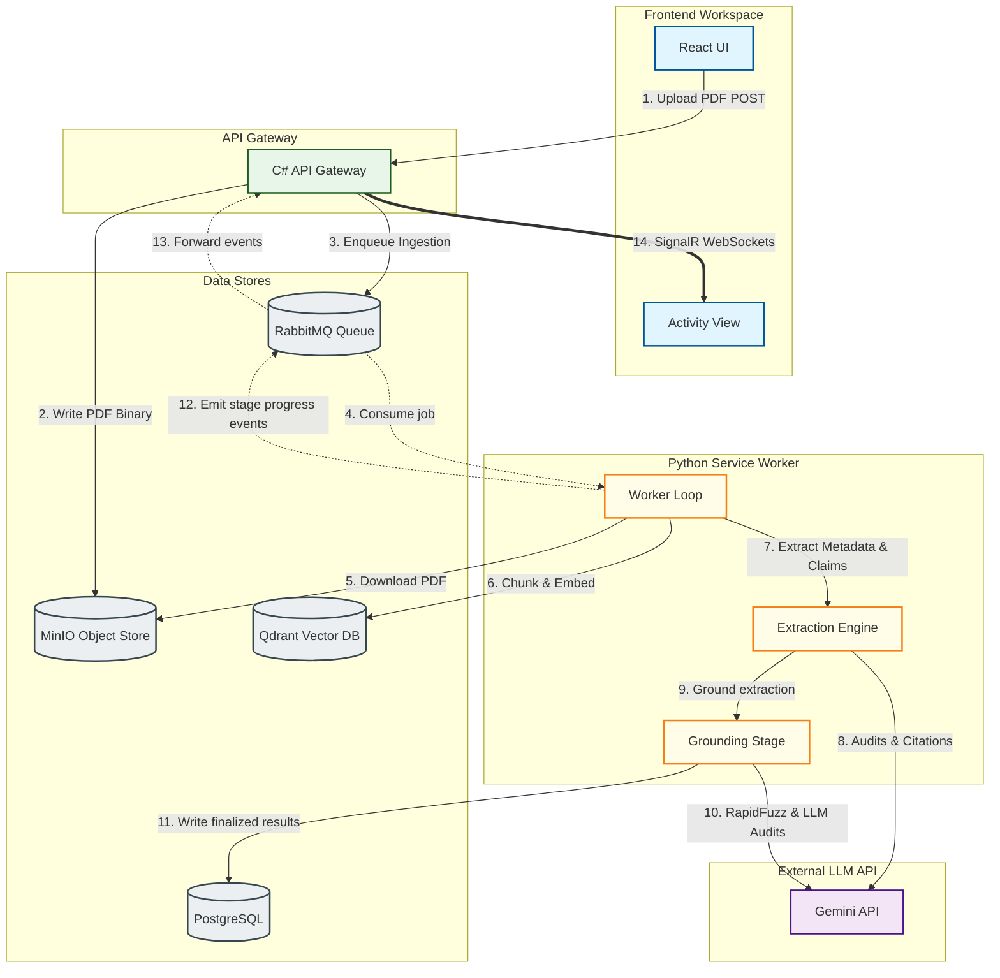
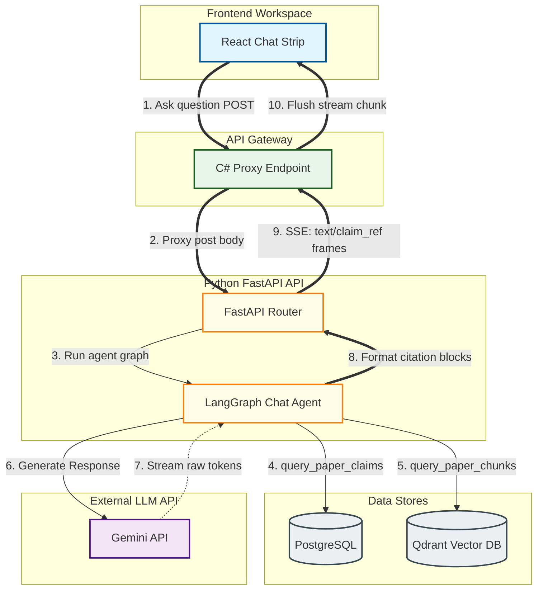

# Prism

**Research-paper claim-auditing agent.**

Prism extracts empirical claims from research papers and audits whether each claim is actually supported by evidence in that same paper. It is built for reviewers and researchers deciding whether to trust a paper's headline findings before citing them. Unlike Elicit, Consensus, and Scite — which help you *find and summarize* papers — Prism audits *one paper's claims against its own evidence*. That is the reviewer's job, not the searcher's. The measurable outcome is a correct-refusal rate on the Claim-Support Matrix across grounding-negative cases, reproducible from a committed eval harness.

---

## What it produces

A **Paper Intelligence Brief** with four sections:

- **Verdict** — Supported / Not-Supported / Partially-Supported with 3 reasons
- **Overstated Claims** — where the paper says more than its data shows
- **Questions to Scrutinize** — what a careful reviewer should probe
- **Claim-Support Matrix** — every empirical claim linked to (or explicitly failing to link to) the evidence

---

## Architecture

Aspire orchestrates the local stack. The system is split into two primary workflows: **Async Ingestion & Extraction** (orchestrated via RabbitMQ queues) and **Conversational Paper Chat** (communicated via real-time Server-Sent Events).

### 1. Async Ingestion & Extraction Pipeline


```mermaid
flowchart TD
    %% Subgraph Styling
    classDef frontend fill:#e1f5fe,stroke:#01579b,stroke-width:2px;
    classDef gateway fill:#e8f5e9,stroke:#1b5e20,stroke-width:2px;
    classDef python fill:#fffde7,stroke:#f57f17,stroke-width:2px;
    classDef store fill:#eceff1,stroke:#37474f,stroke-width:2px;
    classDef llm fill:#f3e5f5,stroke:#4a148c,stroke-width:2px;

    subgraph FE [Frontend Workspace]
        UI[React UI]:::frontend
        AV[Activity View]:::frontend
    end

    subgraph API [API Gateway]
        GW[C# API Gateway]:::gateway
    end

    subgraph WORKER [Python Service Worker]
        PK[Worker Loop]:::python
        EXT[Extraction Engine]:::python
        GRND[Grounding Stage]:::python
    end

    subgraph STORES [Data Stores]
        MinIO[(MinIO Object Store)]:::store
        MQ[(RabbitMQ Queue)]:::store
        PG[(PostgreSQL)]:::store
        QD[(Qdrant Vector DB)]:::store
    end

    subgraph CLOUD [External LLM API]
        Gemini[Gemini API]:::llm
    end

    %% Flow 1: Upload & Enqueue
    UI -->|1. Upload PDF POST| GW
    GW -->|2. Write PDF Binary| MinIO
    GW -->|3. Enqueue Ingestion| MQ

    %% Flow 2: Worker Consumption & Processing
    MQ -.->|4. Consume job| PK
    PK -->|5. Download PDF| MinIO
    PK -->|6. Chunk & Embed| QD
    PK -->|7. Extract Metadata & Claims| EXT
    EXT -->|8. Audits & Citations| Gemini
    EXT -->|9. Ground extraction| GRND
    GRND -->|10. RapidFuzz & LLM Audits| Gemini
    GRND -->|11. Write finalized results| PG

    %% Flow 3: Progress & Completion Events
    PK -.->|12. Emit stage progress events| MQ
    MQ -.->|13. Forward events| GW
    GW ==>|14. SignalR WebSockets| AV
```

### 2. Conversational Paper Chat Flow


```mermaid
flowchart TD
    %% Subgraph Styling
    classDef frontend fill:#e1f5fe,stroke:#01579b,stroke-width:2px;
    classDef gateway fill:#e8f5e9,stroke:#1b5e20,stroke-width:2px;
    classDef python fill:#fffde7,stroke:#f57f17,stroke-width:2px;
    classDef store fill:#eceff1,stroke:#37474f,stroke-width:2px;
    classDef llm fill:#f3e5f5,stroke:#4a148c,stroke-width:2px;

    subgraph FE [Frontend Workspace]
        CS[React Chat Strip]:::frontend
    end

    subgraph API [API Gateway]
        GW[C# Proxy Endpoint]:::gateway
    end

    subgraph PY_API [Python FastAPI API]
        FastAPI[FastAPI Router]:::python
        Agent[LangGraph Chat Agent]:::python
    end

    subgraph STORES [Data Stores]
        PG[(PostgreSQL)]:::store
        QD[(Qdrant Vector DB)]:::store
    end

    subgraph CLOUD [External LLM API]
        Gemini[Gemini API]:::llm
    end

    %% Chat Stream Flow
    CS ==>|1. Ask question POST| GW
    GW ==>|2. Proxy post body| FastAPI
    FastAPI -->|3. Run agent graph| Agent

    %% Retrieval Tools (Bypassed tool routing; runs both concurrently)
    Agent -->|4. query_paper_claims| PG
    Agent -->|5. query_paper_chunks| QD

    %% Response Generation & SSE Streaming
    Agent -->|6. Generate Response| Gemini
    Gemini -.->|7. Stream raw tokens| Agent
    Agent ==>|8. Format citation blocks| FastAPI
    FastAPI ==>|9. SSE: text/claim_ref frames| GW
    GW ==>|10. Flush stream chunk| CS
```

---

## Tech Stack

| Category | Technology | Version/Notes |
|----------|-----------|---------------|
| Backend runtime | .NET | 10 (via `global.json`) |
| Backend framework | ASP.NET Core, Aspire | Aspire 13.4.6 |
| Data access (C#) | EF Core | 10 |
| Frontend | React + Vite + TypeScript | React 19 |
| Real-time | SignalR | — |
| AI worker runtime | Python | 3.13 |
| AI worker packaging | uv | — |
| Agent framework | LangGraph + FastAPI | — |
| LLM client | google-genai | — |
| LLM models | Gemini 3.6 Flash (extractor + per-claim auditor + per-claim structurer), Gemini 3.1 Flash Lite (grounding audit) | Env-driven |
| Vector store | Qdrant | 1.18 |
| Relational DB | PostgreSQL | 18 |
| Async queue | RabbitMQ | 4.3-management |
| Object storage | MinIO | 2025-09-07 release |
| Cache (provisioned) | Redis | 8 |
| DB driver (Python) | psycopg3 async | binary + pool |
| Observability | OpenTelemetry via Aspire | 1.16 |

---

## Prerequisites

- [ ] .NET 10 SDK (pinned via `global.json`)
- [ ] Docker Desktop (for Postgres, Qdrant, RabbitMQ, MinIO, Redis containers)
- [ ] `uv` (Python package manager)
- [ ] Node.js 20+ (for React frontend)
- [ ] Google Gemini API key (from https://aistudio.google.com/apikey)

---

## Quick Start

1. **Clone and set up secrets**
   ```powershell
   git clone https://github.com/i-mouse/prism.git
   cd prism
   .\setup.ps1
   ```

2. **Configure your Gemini API key** — stored via .NET user secrets:
   ```powershell
   cd Prism.AppHost
   dotnet user-secrets set "GoogleApiKey" "<your-key>"
   cd ..
   ```
   `setup.ps1` will prompt for all other secrets (RabbitMQ, MinIO, Qdrant) interactively.

3. **Start the local dev environment**
   ```powershell
   .\dev.ps1
   ```

4. **Open the Aspire dashboard** at the URL printed in the terminal. Wait for all resources to show "Running".

5. **Open the Prism UI** at http://localhost:7000 and upload a research paper PDF.

---

## Local Service URLs

| Service | URL |
|---------|-----|
| Aspire Dashboard | (printed at startup) |
| React UI | http://localhost:7000 |
| C# API Gateway | http://localhost:5269 |
| Python API | (Aspire-assigned) |
| pgAdmin | (Aspire-assigned) |
| MinIO Console | (Aspire-assigned) |
| Qdrant Dashboard | (Aspire-assigned) |
| RabbitMQ Management | (Aspire-assigned) |

---

## Repository Structure

```
prism/
├── Prism.AppHost/                  # Aspire orchestration
├── Prism.ApiService/               # C# API Gateway + SignalR hub
│   ├── Data/Schemas/               # EF Core entities
│   ├── Migrations/                 # EF Core migrations
│   ├── Services/                   # RabbitMQ setup + listener
│   └── Hubs/                       # SignalR DocumentHub
├── Prism.PythonService/            # Python worker + API
│   ├── extraction/                 # Extraction pipeline, grounding, DB writer
│   ├── prompts/                    # System prompts + few-shot JSONs
│   │   ├── audit_claim_system.md   # Per-claim reasoning auditor
│   │   └── structure_verdict_system.md # Parses audit into JSON
│   ├── main.py                     # RabbitMQ consumer (ingestion pipeline)
│   ├── api.py                      # FastAPI for chat endpoints
│   ├── agent_service.py            # LangGraph agent
│   ├── RAGService.py               # Qdrant embed + upsert
│   └── memory_db.py                # Shared psycopg3 pool
├── Prism.Web/                      # React 19 + Vite frontend
├── Prism.ServiceDefaults/          # Aspire service defaults
├── docs/
│   ├── decisions.md                # Chronological technical decisions
│   ├── diagrams/                   # current.png + target.png (TODO: current.png is stale)
│   ├── evals/                      # matrix_eval.json + golden_eval.json
│   ├── research_papers/            # Sample PDFs for testing
│   ├── PRODUCT_BRIEF.md            # Product vision + build order
│   └── RUNBOOK.md                  # Developer gotchas and tips
│
├── README.md                       # This file
├── dev.ps1                         # Start local dev
├── setup.ps1                       # One-time setup
├── global.json                     # .NET SDK pin
└── Prism.sln
```

---

## Documentation

- **[Product Brief](docs/PRODUCT_BRIEF.md)** — vision, target user, wedge, build order
- **[Decisions Log](docs/decisions.md)** — chronological technical decisions
- **[Developer Runbook](docs/RUNBOOK.md)** — setup gotchas, quota tracking, debugging configuration
- **[Architecture diagrams](docs/diagrams/)** — current + target state (<!-- TODO: current.png is stale and does not reflect the three-call extraction pipeline -->)
- **[Evaluation datasets](docs/evals/)** — golden test sets for correct-refusal measurement

---

## Eval harness — reproducing the number

Local iteration (uses live Postgres via Aspire):
```powershell
cd Prism.PythonService
uv run python -m eval.matrix_runner --source db
```

After a prompt change worth committing:
```powershell
uv run python -m eval.dump_fixture
git add prompts/ docs/evals/fixtures/
git commit -m "..."
```

CI runs `matrix_runner --source fixture` on every PR and blocks the merge
on regression. Fixture freshness is checked separately — if the prompt
files changed but the fixture wasn't regenerated, CI fails with a clear
message telling you which paper to re-dump.

---

## Roadmap

### Shipped
- **Slice 1 — Matrix UI:** Three-panel claim-support workspace, right-side evidence drawer, paper-primary sidebar, and `displayLabel` grounder-wins fallback.
- **Slice 2 + 2.5 — Ingestion Progress Events:** 5-stage activity view with sub-progression (e.g., grounding verification counters), drawer collapse handling, three-zone composition, and Framer Motion `popLayout` transitions.
- **Slice 3a — Paper-scoped LangGraph Chat Backend:** FastAPI SSE endpoint, concurrent Postgres full-text and Qdrant chunk retrieval tools, check_empty OR logic, and structured citation-block formatting.
- **Slice 3b + 3b.1 + 3b.2 — Chat Strip UI:** Streaming fetch ReadableStream client, inline claim citation buttons, key-based remount for paper switching, stop/abort button, dynamic follow-up suggestions, and visual polish.

### Pending — critical path to V1
- **Slice 2.8 — Grounding tuning:** Widen RapidFuzz/audit context window, establish 3-tier verdict rubric, and track false-rejection metrics.
- **Slice 3c — Delete legacy general chat:** Clean up and delete unused `ai_service.py`, `agent_service.py`, and the old `/api/chat/ask` API endpoint.
- **Azure deployment:** Provision Container Apps, Postgres Flexible Server, AI Search, Key Vault, and Managed Identity.
- **V1 ship:** Launch live URL, publish project blog post, and record a walkthrough demo.

### Post-V1
- **Tier 2 — Multi-paper chat:** Cross-paper retrieval, literature synthesis, and Matrix view navigation rework.
- **Tier 3 — Web-grounded chat:** Route queries to external search engine tools to verify claims against the web.
- **Document Intelligence:** Structure-aware chunking for layout-aware PDF parsing.
- **Auth / multi-tenancy:** Secure user authentication and workspace session isolation.
- **Unit + integration tests:** Expand test suites beyond the extraction pipeline smoke test.
- **MCP wrapper:** Expose the claim extractor as a Model Context Protocol server.
- **Foundry Pattern C migration:** Align Azure agent hosting with Azure AI-103 standards.
- **Groq / LiteLLM:** Implement model routing for faster/cheaper tool execution.

### Deferred debt (tracked, not blocking)
- **Postgres volume password drift:** Remove `.WithDataVolume()` on Postgres in `Prism.AppHost/AppHost.cs` or nuke container volumes on authorization failures.
- **Status synchronization:** `prism_documents.status` never flips to "Completed" post-extraction in C# models.
- **Human-readable reason strings:** C# API projects require frontend to run `humanizeReason()` client-side workaround rather than writing clean reason strings from Python.
- **Page numbers in evidence spans:** Currently saved as null; requires page-aware chunking provenance backfill.
- **Stale-state sidebar detection:** Show a "Stuck — retry" warning pill after 10 minutes of a document remaining "In progress".
- **Real "Open Paper" wiring:** Reconnect the button stub (currently showing toast) to opening the PDF viewer.
- **CORS hardcoding:** C# API gateway hardcodes CORS origins to `localhost:7000`.
- **EF Core JSON mapping:** `document_extractors.Fields` maps as a JSONB string in EF Core rather than typed metadata fields.
- **SignalR reconnect race:** Race condition where clients miss the `DocumentProcessed` message during a websocket reconnect.
- **User authorization mock:** Hardcoded user ID (`demo-user-01`) used across frontend and backend endpoints.

---

## Status

Portfolio project demonstrating Senior Azure AI Engineer capabilities: multi-service orchestration, async ingestion pipelines, LLM structured output, deterministic grounding, and evaluation-driven design. The eval harness reports refusal-recall split into by_label and by_omission counts on a golden set of 17 grounding-negative cases across three papers. Not open to external contributions.

---

## License

See [LICENSE](LICENSE).
