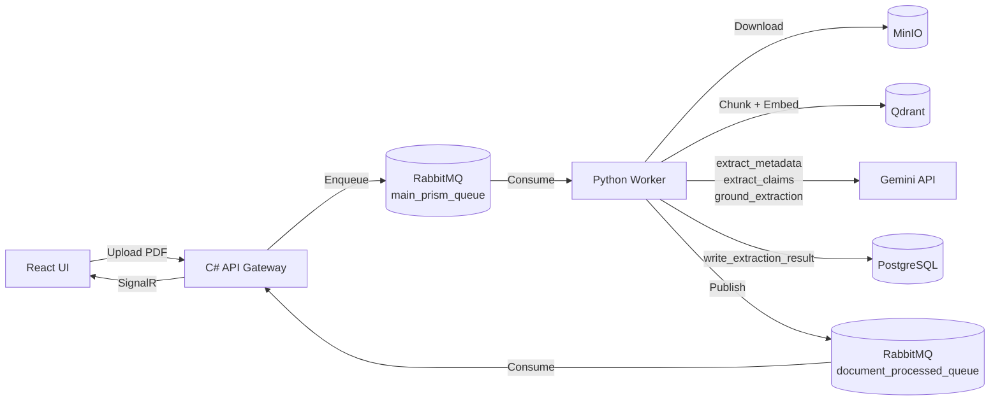

# Prism

**Research-paper claim-auditing agent.**

Prism extracts empirical claims from research papers and audits whether each claim is actually supported by evidence in that same paper. It is built for reviewers and researchers deciding whether to trust a paper's headline findings before citing them. Unlike Elicit, Consensus, and Scite — which help you *find and summarize* papers — Prism audits *one paper's claims against its own evidence*. That is the reviewer's job, not the searcher's. The measurable outcome is a correct-refusal rate on the Claim-Support Matrix across grounding-negative cases, reproducible from a committed eval harness.

---

## What it produces

A **Paper Intelligence Brief** with four sections:

- **Verdict** — Supported / Not-Supported / Partially-Supported with 3 reasons
- **Overstated Claims** — where the paper says more than its data shows
- **Questions to Scrutinize** — what a careful reviewer should probe
- **Claim-Support Matrix** — every empirical claim linked to (or explicitly failing to link to) the evidence

---

## Architecture

Aspire orchestrates the local stack. A React 19 + Vite frontend uploads papers via a C# .NET 10 API Gateway. A Python 3.13 worker consumes the RabbitMQ queue and runs the ingestion pipeline: parse, chunk+embed to Qdrant, extract metadata and claims with Gemini, ground each claim against the paper text, and persist to PostgreSQL. SignalR pushes completion events back to the UI.


```mermaid
flowchart LR
    UI[React UI] -->|Upload PDF| API[C# API Gateway]
    API -->|Enqueue| MQ1[(RabbitMQ<br/>main_prism_queue)]
    MQ1 -->|Consume| Worker[Python Worker]
    Worker -->|Download| MinIO[(MinIO)]
    Worker -->|Chunk + Embed| Qdrant[(Qdrant)]
    Worker -->|extract_metadata<br/>extract_claims<br/>ground_extraction| Gemini[Gemini API]
    Worker -->|write_extraction_result| PG[(PostgreSQL)]
    Worker -->|Publish| MQ2[(RabbitMQ<br/>document_processed_queue)]
    MQ2 -->|Consume| API
    API -->|SignalR| UI
```

---

## Tech Stack

| Category | Technology | Version/Notes |
|----------|-----------|---------------|
| Backend runtime | .NET | 10 (via `global.json`) |
| Backend framework | ASP.NET Core, Aspire | Aspire 13.4.6 |
| Data access (C#) | EF Core | 10 |
| Frontend | React + Vite + TypeScript | React 19 |
| Real-time | SignalR | — |
| AI worker runtime | Python | 3.13 |
| AI worker packaging | uv | — |
| Agent framework | LangGraph + FastAPI | — |
| LLM client | google-genai | — |
| LLM models | Gemini 3.6 Flash (extraction), Gemini 3.1 Flash Lite (audit) | Env-driven |
| Vector store | Qdrant | 1.18 |
| Relational DB | PostgreSQL | 18 |
| Async queue | RabbitMQ | 4.3-management |
| Object storage | MinIO | 2025-09-07 release |
| Cache (provisioned) | Redis | 8 |
| DB driver (Python) | psycopg3 async | binary + pool |
| Observability | OpenTelemetry via Aspire | 1.16 |

---

## Prerequisites

- [ ] .NET 10 SDK (pinned via `global.json`)
- [ ] Docker Desktop (for Postgres, Qdrant, RabbitMQ, MinIO, Redis containers)
- [ ] `uv` (Python package manager)
- [ ] Node.js 20+ (for React frontend)
- [ ] Google Gemini API key (from https://aistudio.google.com/apikey)

---

## Quick Start

1. **Clone and set up secrets**
   ```powershell
   git clone https://github.com/i-mouse/prism.git
   cd prism
   .\setup.ps1
   ```

2. **Configure your Gemini API key** — stored via .NET user secrets:
   ```powershell
   cd Prism.AppHost
   dotnet user-secrets set "GoogleApiKey" "<your-key>"
   cd ..
   ```
   `setup.ps1` will prompt for all other secrets (RabbitMQ, MinIO, Qdrant) interactively.

3. **Start the local dev environment**
   ```powershell
   .\dev.ps1
   ```

4. **Open the Aspire dashboard** at the URL printed in the terminal. Wait for all resources to show "Running".

5. **Open the Prism UI** at http://localhost:7000 and upload a research paper PDF.

---

## Local Service URLs

| Service | URL |
|---------|-----|
| Aspire Dashboard | (printed at startup) |
| React UI | http://localhost:7000 |
| C# API Gateway | http://localhost:5269 |
| Python API | (Aspire-assigned) |
| pgAdmin | (Aspire-assigned) |
| MinIO Console | (Aspire-assigned) |
| Qdrant Dashboard | (Aspire-assigned) |
| RabbitMQ Management | (Aspire-assigned) |

---

## Repository Structure

```
prism/
├── Prism.AppHost/                  # Aspire orchestration
├── Prism.ApiService/               # C# API Gateway + SignalR hub
│   ├── Data/Schemas/               # EF Core entities
│   ├── Migrations/                 # EF Core migrations
│   ├── Services/                   # RabbitMQ setup + listener
│   └── Hubs/                       # SignalR DocumentHub
├── Prism.PythonService/            # Python worker + API
│   ├── extraction/                 # Prompts 1+2, grounding, DB writer
│   ├── prompts/                    # System prompts + few-shot JSONs
│   ├── main.py                     # RabbitMQ consumer (ingestion pipeline)
│   ├── api.py                      # FastAPI for chat endpoints
│   ├── agent_service.py            # LangGraph agent
│   ├── RAGService.py               # Qdrant embed + upsert
│   └── memory_db.py                # Shared psycopg3 pool
├── Prism.Web/                      # React 19 + Vite frontend
├── Prism.ServiceDefaults/          # Aspire service defaults
├── docs/
│   ├── decisions.md                # Chronological technical decisions
│   ├── diagrams/                   # current.png + target.png
│   ├── evals/                      # matrix_eval.json + golden_eval.json
│   └── research_papers/            # Sample PDFs for testing
|   └── PRODUCT_BRIEF.md                # Product vision + build order

├── README.md                       # This file
├── dev.ps1                         # Start local dev
├── setup.ps1                       # One-time setup
├── global.json                     # .NET SDK pin
└── Prism.sln
```

---

## Documentation

- **[Product Brief](docs/PRODUCT_BRIEF.md)** — vision, target user, wedge, build order
- **[Decisions Log](docs/decisions.md)** — chronological technical decisions
- **[Architecture diagrams](docs/diagrams/)** — current + target state
- **[Evaluation datasets](docs/evals/)** — golden test sets for correct-refusal measurement

---

## Eval harness — reproducing the number

Local iteration (uses live Postgres via Aspire):
```powershell
cd Prism.PythonService
uv run python -m eval.matrix_runner --source db
```

After a prompt change worth committing:
```powershell
uv run python -m eval.dump_fixture
git add prompts/ docs/evals/fixtures/
git commit -m "..."
```

CI runs `matrix_runner --source fixture` on every PR and blocks the merge
on regression. Fixture freshness is checked separately — if the prompt
files changed but the fixture wasn't regenerated, CI fails with a clear
message telling you which paper to re-dump.

---

## Roadmap

Not yet built:

- Eval harness runner (loads `matrix_eval.json`, computes correct-refusal rate)
- Paper Intelligence Brief UI (Verdict card, Overstated Claims, Matrix table)
- C# API endpoints exposing `paper_claims` to the UI
- Azure deployment (Container Apps, Postgres Flexible Server, AI Search)
- Foundry Pattern C migration for the agent
- Document Intelligence for structure-aware chunking
- Auth / multi-tenancy
- MCP wrapper
- Unit + integration tests

---

## Status

Portfolio project demonstrating Senior Azure AI Engineer capabilities: multi-service orchestration, async ingestion pipelines, LLM structured output, deterministic grounding, and evaluation-driven design. Not open to external contributions.

---

## License

See [LICENSE](LICENSE).
