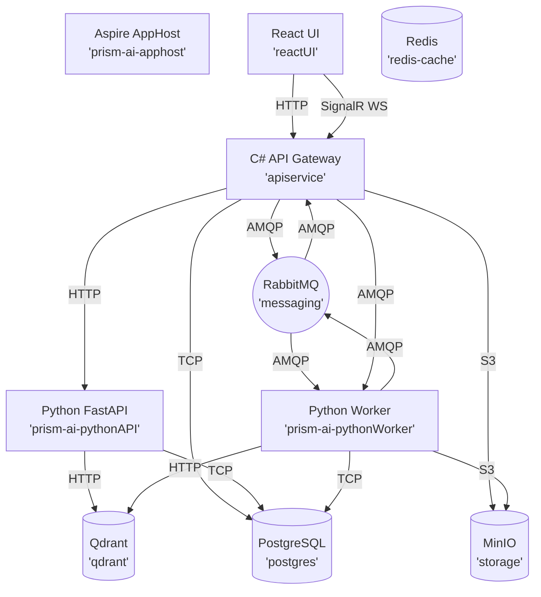
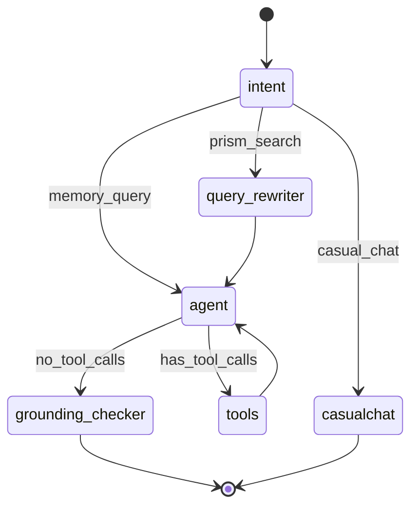
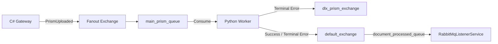
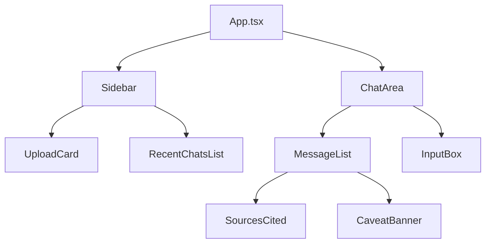
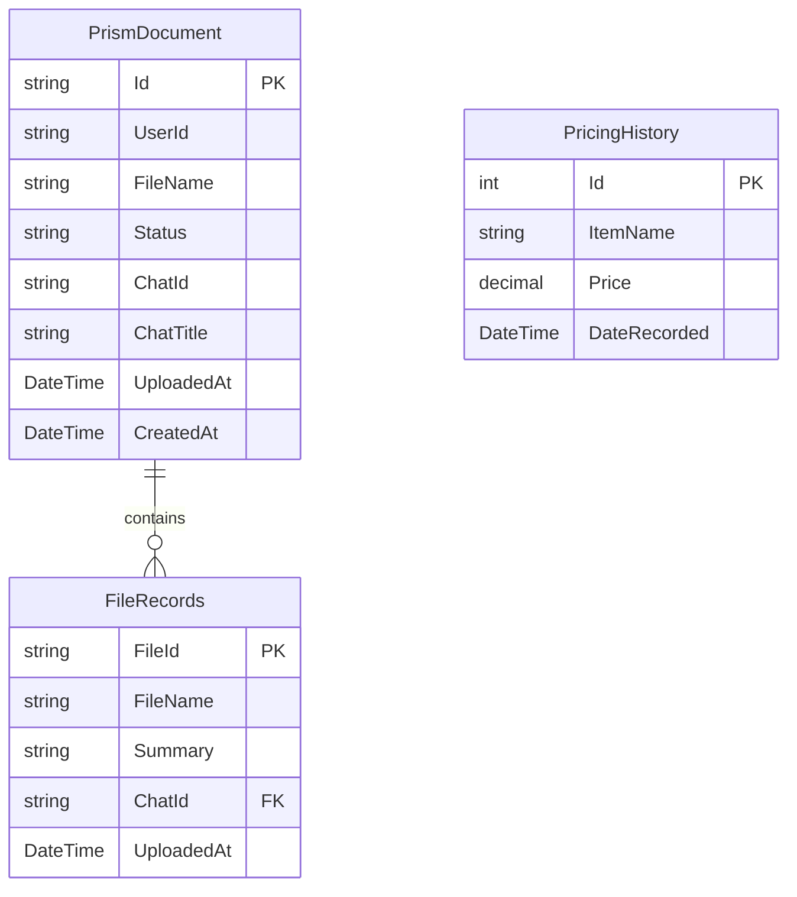

# Prism Architecture Reference

### 1. System map
Prism operates as a highly decoupled event-driven system coordinated by .NET Aspire. The C# API Gateway routes chat traffic to Python via HTTP, while offloading heavy document ingestion to an async worker via RabbitMQ. 



### 2. Aspire orchestration
`Prism.AppHost/AppHost.cs` defines the container topology.

| Resource Name | Type | References / Dependencies (`WaitFor`) | Bound Parameters / Secrets |
|---|---|---|---|
| `redis-cache` | Redis | none | none |
| `messaging` | RabbitMQ | none | `rabbitmquser`, `rabbitmqpass` |
| `storage` | MinIO | none | `MinioUser`, `MinioSecret` |
| `postgres` | PostgreSQL | none | none |
| `qdrant` | Qdrant | none | `QdrantApiKey` |
| `prism-ai-pythonAPI` | Dockerfile | `qdrant`, `postgres` | `AI_API_KEY` (from `GoogleApiKey`) |
| `prism-ai-pythonWorker` | PythonApp (`uv`) | `storage`, `messaging`, `qdrant`, `postgres` | `AI_API_KEY` |
| `apiservice` | Project | `redis-cache`, `postgres`, `messaging`, `qdrant`, `storage`, `prism-ai-pythonAPI` | `DEPLOYMENT_REGION` |
| `reactUI` | NpmApp | `apiservice` | `VITE_API_BASE_URL` |

– Secrets flow: `dotnet user-secrets` → `builder.AddParameter(..., secret: true)` → Container injection.
– Custom python worker starts via `main.py` using `uv` runner.
– The `WaitFor` chain forces DBs to initialize before APIs, preventing race conditions.

### 3. C# API Gateway (`Prism.ApiService`)

**Controllers:**
– `Prism.ApiService/Features/Chat/ChatEndPoint.cs:15-66`
  – `POST /api/chat/ask`: Accepts `ChatRequest`, saves to DB, forwards to Python API via `HttpClient("pythonapi")`, returns `ChatResponse`.
  – `GET /api/chat/{chatId}/history`: Proxies chat history from Python.
– `Prism.ApiService/Features/RfpSubmission/SubmitRfpEndPoint.cs:14-48`
  – `POST /rfp`: Accepts `SubmitRfpRequest` (multipart form). Streams to MinIO, updates EF Core, publishes `PrismUploaded` to RabbitMQ.
  – `GET /api/chats/{userId}`: Queries EF Core for chat history metadata.
– `Prism.ApiService/Features/System/SystemEndPoint.cs:13-36`
  – `DELETE /api/system/reset`: Truncates `prismDocuments` CASCADE in EF Core, calls Python `DELETE /api/system/reset` to wipe Qdrant and LangGraph checkpoints.

**SignalR Hub:**
– `Prism.ApiService/Hubs/DocumentHub.cs:9-12`: Exposes `/hubs/document`. Has no explicit connection logic or client-to-server events.
– Server→Client Event: `DocumentProcessed`. Emitted by `Prism.ApiService/Services/RabbitMqListenerService.cs:62` pushing JSON objects directly.

**EF Core:**
– `PrismDBContext` connects to `prism-db` via Aspire injected string.
– `Prism.ApiService/Data/Schemas/PrismDocument.cs:5-22`: `Id`, `UserId`, `FileName`, `UploadedAt`, `CreatedAt`, `Status`, `ChatId`, `ChatTitle`, `Files`.
– `Prism.ApiService/Data/Schemas/FileRecords.cs:5-18`: `FileId`, `FileName`, `Summary`, `UploadedAt`, `ChatId`, `Chat`.
– `Prism.ApiService/Data/Schemas/PricingHistory.cs:5-12`: `Id`, `ItemName`, `Price`, `DateRecorded`.

### 4. Python AI service (`Prism.PythonService`)

#### 4.1 FastAPI surface
– `POST /api/chat/ask` (`Prism.PythonService/api.py:43-90`): Takes `QueryRequest`, invokes `compiled_agent`, extracts response, caveat, intent, and sources. Sync via async event loop.
– `GET /api/chat/{chatid}/history` (`Prism.PythonService/api.py:91-128`): Reads directly from PostgreSQL checkpoint via `aget_state`. Returns formatted history.
– `DELETE /api/system/reset` (`Prism.PythonService/api.py:130-150`): Deletes Qdrant collection, drops checkpoints table.

#### 4.2 LangGraph state graph
```python
class AgentState(TypedDict):
    messages: Annotated[list, add_messages]
    original_query: str
    rewritten_query: str
    intent: str 
    retrieved_chunks: list[RetrievedChunk]
    grounding_passed: bool
    confidence_score: float
    final_answer: Optional[str]
    caveat: Optional[str]
```

| Node | Read | Write | Model | Cost per call |
|---|---|---|---|---|
| `intent` | `messages` | `intent`, `original_query` | `gemini-3.1-flash-lite` | Very low (~50 tokens) |
| `casualchat` | `messages` | `messages` | `gemini-3.1-flash-lite` | Very low (~200 tokens) |
| `query_rewriter` | `messages` | `rewritten_query`, `original_query` | `gemini-3.1-flash-lite` | Low (~100 tokens) |
| `agent` | `messages`, `rewritten_query` | `messages` | `gemini-flash-latest` | Medium (depends on history) |
| `grounding_checker` | `messages` | `grounding_passed`, `caveat` | `gemini-3.1-flash-lite` | High (reads chunk context) |

#### 4.3 CRAG flow
– **Intent Classifier:** Categorizes query to skip heavy search. Prompt in `Prism.PythonService/agent_service.py:15-23`.
– **HyDE Rewriter:** Converts question to dense keywords. Prompt in `Prism.PythonService/agent_service.py:102-107`.
– **Retriever:** `search_prism_doc` tool. Reads from Qdrant, returns JSON string of sources.
– **Generator:** Agent node. Prompt enforces rule: "MUST use the `search_prism_doc` tool to fetch... Do not answer from memory alone."
– **Grounding Checker:** Audits generator against source chunks.

#### 4.4 Grounding checker
– Algorithm: Extracts tool outputs, compares proposed answer to context. Returns "PASS" or "FAIL".
– Threshold: Exact match requirement via prompt constraints. Caveat added if failed.
– Prompt (`Prism.PythonService/agent_service.py:170-180`):
```text
You are a strict legal auditor. 
Look at the Proposed Answer, and check if it is completely supported by the Source Documents.
If the Proposed Answer contains facts, numbers, or claims NOT found in the Source Documents, you must fail it.
Source Documents:
{context[:4000]}
Proposed Answer:
{proposed_answer}
Reply ONLY with the word "PASS" if the answer is completely supported, or "FAIL" if it contains ungrounded claims/hallucinations.
```
– Path: `grounding_checker_node` sets `caveat` in `AgentState` → `Prism.PythonService/api.py:61` reads `result.get("caveat")` → Returns in HTTP JSON → `Prism.Web/src/App.tsx:271` stores in state → React renders yellow banner.

#### 4.5 Async workers (ingestion pipeline)
– Entry point: `Prism.PythonService/main.py:30` executed via `uv run` triggered by Aspire.

– **Terminal vs Transient Error:**
  – Terminal: `except fitz.FileDataError as e:` (`Prism.PythonService/main.py:154-171`). Acknowledges, publishes `Error` status to SignalR queue, rejects with `requeue=False` sending to DLQ.
  – Transient: `except Exception as e:` (`Prism.PythonService/main.py:176-184`). Sleeps 5s, rejects with `requeue=True` putting back in main queue. No UI update emitted.

#### 4.6 Embedding & vector store
– Model: `BAAI/bge-small-en-v1.5` via FastEmbed (`Prism.PythonService/RAGService.py:18`).
– Dim: `384` (`Prism.PythonService/RAGService.py:27`).
– Chunking: Size 1200, Overlap 200, via `RecursiveCharacterTextSplitter`. No format-specific branching.
– Qdrant: Collection `prism_docs`, Cosine distance. Payload includes `filename`, `text`, `chunk_index`.

#### 4.7 LangGraph PostgreSQL checkpointer
– Connection: `Prism.PythonService/memory_db.py:4-14` uses `psycopg_pool.AsyncConnectionPool`.
– Init happens in `Prism.PythonService/api.py:19-24` and `Prism.PythonService/main.py:48-52` calling `.setup()`.
– Uses `thread_id` equal to UI `chatId` (`crypto.randomUUID()`).
– TTL: None configured. **Future concern:** State will grow indefinitely without cleanup.

### 5. React frontend (`Prism.Web`)

– State: React `useState`. Session tracking via `sessionStorage.getItem('prism_active_chat')`.
– SignalR: Established in `useEffect` (`Prism.Web/src/App.tsx:121-173`). Uses jitter retry policy.
– Upload Flow: `handleUpload` posts `FormData` to `/rfp`. SignalR `DocumentProcessed` event triggers `pendingFilesCount.current -= 1` and updates UI status.
– Caveat Banner: Rendered conditionally if `msg.caveat` exists.
– Sources: Rendered below the message bubble (`Prism.Web/src/App.tsx:465-484`), using inline mapping.

### 6. Data model summary

– MinIO: Uses bucket `prism-uploads`. Object keys are `file.FileName`. No lifecycle rules configured.

### 7. Configuration & secrets surface
| Config Key | Source | Consumption Point | Secret |
|---|---|---|---|
| `GoogleApiKey` | `user-secrets` | `Prism.AppHost/AppHost.cs:9` -> `AI_API_KEY` | Yes |
| `rabbitmquser` | `user-secrets` | `Prism.AppHost/AppHost.cs:10` | Yes |
| `rabbitmqpass` | `user-secrets` | `Prism.AppHost/AppHost.cs:11` | Yes |
| `MinioUser` | `user-secrets` | `Prism.AppHost/AppHost.cs:13` | Yes |
| `MinioSecret` | `user-secrets` | `Prism.AppHost/AppHost.cs:14` | Yes |
| `QdrantApiKey` | `user-secrets` | `Prism.AppHost/AppHost.cs:16` | Yes |
| `DEPLOYMENT_REGION` | Hardcoded | `Prism.AppHost/AppHost.cs:46` | No |
| `VITE_API_BASE_URL` | Aspire binding | `Prism.AppHost/AppHost.cs:58` | No |

### 8. Observability
– LangSmith: Suggested config via `.env` (`LANGSMITH_PROJECT="Prism"`). Not enforced by code.
– Aspire Dashboard: Collects OTLP from `apiservice` automatically via `Prism.ServiceDefaults/Extensions.cs`.

### 9. Documented elsewhere but not implemented
These are components referenced in design docs (PRODUCT_BRIEF, target architecture diagram) or provisioned by Aspire but with no implementing code today. Listed here so the HANDOFF stays the technical ground truth.

– **Redis caching.** Container is provisioned by Aspire (`AppHost.cs:7`), but no caching logic exists in C# or Python.
– **Speaker diarization + PII redaction in audio.** Current implementation is naive transcription via `gemini-2.5-flash` (`Prism.PythonService/ai_service.py:53`). Roadmap item.
– **Pricing calculations.** `PricingHistory` schema exists (`Prism.ApiService/Data/Schemas/PricingHistory.cs`) but is unused. Candidate for deletion or implementation.
– **gRPC low-latency path.** REST HTTP only today (`api.py`). Listed in README Roadmap.

### 10. TODOs & rough edges
| File:Line | Comment | Resolution |
|---|---|---|
| `Prism.PythonService/agent_service.py:124` | `# FIX: Enterprise Fault Tolerance via Try/Except` | Improve exception type specificity for database operations. |
| `Prism.PythonService/agent_service.py:90` | `# Only passing last 3 messages to save tokens/money` | Expose truncation length via config. |
| `Prism.ApiService/Features/RfpSubmission/SubmitRfpEndPoint.cs:148` | `// 4. 🔥 THE FIX: Attach it directly to the Parent Entity!` | Move navigation property attachment out of the endpoint into a repository pattern. |

### 11. How to run
See README §🚀. 
**Undocumented requirements:**
– Must explicitly create local MinIO bucket `prism-uploads` if the C# auto-creation (`Prism.ApiService/Program.cs:89`) races ahead of MinIO readiness.
– Python `uv` package manager must be available on the host machine `PATH` as Aspire's `WithUv()` relies on it.

### 12. Quick-reference appendix

**AppHost.cs (`Prism.AppHost/AppHost.cs`)**
```csharp
using Microsoft.Extensions.Configuration;
using YamlDotNet.Serialization;

var builder = DistributedApplication.CreateBuilder(args);

//add Redis
var cache = builder.AddRedis("redis-cache");

var apiKey = builder.Configuration["GoogleApiKey"];
var userrabbitmq = builder.AddParameter( name:"rabbitmquser",secret :true);
var passrabbitmq = builder.AddParameter( name:"rabbitmqpass",secret :true);

var minioUser = builder.AddParameter("MinioUser");
var minioPass = builder.AddParameter("MinioSecret", secret: true);

var qdrantKey = builder.AddParameter("QdrantApiKey", secret: true);

var rabbitMQ = builder.AddRabbitMQ ("messaging",userName : userrabbitmq,password:passrabbitmq).WithDataVolume().WithManagementPlugin();
var miniIO = builder.AddMinioContainer("storage",rootUser:minioUser,rootPassword:minioPass).WithDataVolume();

var postgres = builder.AddPostgres("postgres").WithPgAdmin().WithDataVolume().AddDatabase("prism-db");

var qdrantDB = builder.AddQdrant ("qdrant",apiKey:qdrantKey).WithDataVolume();

var pythonAPI = builder.AddDockerfile("prism-ai-pythonAPI", "../Prism.PythonService")
    .WithHttpEndpoint(targetPort: 8000, name: "pythonapi", env: "PORT")
    .WithReference(qdrantDB)
    .WithEnvironment("AI_API_KEY", apiKey)
    .WithReference(postgres)
    .WaitFor(postgres);
                
 builder.AddPythonApp("prism-ai-pythonWorker","../Prism.PythonService","main.py")
    .WithReference(miniIO).WithReference(rabbitMQ).WithReference(qdrantDB).WithReference(postgres) 
    .WithEnvironment("AI_API_KEY",apiKey).WithUv().WithDebugging().WaitFor(postgres);

var apiservice = builder.AddProject<Projects.Prism_ApiService>("apiservice")
    .WithEnvironment("DEPLOYMENT_REGION","US-East")
    .WithReference(cache).WithReference(postgres).WaitFor(postgres)
    .WithReference(rabbitMQ).WaitFor(rabbitMQ)
    .WithReference(qdrantDB).WithReference(miniIO)
    .WithReference(pythonAPI.GetEndpoint("pythonapi"));

 builder.AddNpmApp("prism-ai-reactUI","../Prism.Web")
    .WithHttpEndpoint(port:7000,name: "reactUI",env: "VITE_PORT")
    .WithEnvironment("VITE_API_BASE_URL", apiservice.GetEndpoint("https"))
    .WithReference(apiservice);              

builder.Build().Run();
```

**LangGraph State (`Prism.PythonService/agent_service.py:30-39`)**
```python
class AgentState(TypedDict):
    messages: Annotated[list, add_messages]
    original_query: str
    rewritten_query: str
    intent: str 
    retrieved_chunks: list[RetrievedChunk]
    grounding_passed: bool
    confidence_score: float
    final_answer: Optional[str]
    caveat: Optional[str]
```

**StateGraph Builder (`Prism.PythonService/agent_service.py:217-235`)**
```python
workflow = StateGraph(AgentState)
workflow.add_node("casualchat", casual_chat_node)
workflow.add_node("intent", intent_decision_node)
workflow.add_node("query_rewriter", query_rewriter_node)
workflow.add_node("agent", agent_node)
workflow.add_node("tools", tool_nodes)
workflow.add_node("grounding_checker", grounding_checker_node)

workflow.set_entry_point("intent")
workflow.add_conditional_edges("intent", route_by_intent, {
    "casualchat": "casualchat",
    "agent": "agent",                 
    "query_rewriter": "query_rewriter"
})
workflow.add_edge("casualchat", END)
workflow.add_edge("query_rewriter", "agent")
workflow.add_conditional_edges("agent", route_after_agent)
workflow.add_edge("tools", "agent")
workflow.add_edge("grounding_checker", END)
```

**Grounding-Checker Prompt (`Prism.PythonService/agent_service.py:170-180`)**
```text
You are a strict legal auditor. 
Look at the Proposed Answer, and check if it is completely supported by the Source Documents.
If the Proposed Answer contains facts, numbers, or claims NOT found in the Source Documents, you must fail it.

Source Documents:
{context[:4000]}

Proposed Answer:
{proposed_answer}

Reply ONLY with the word "PASS" if the answer is completely supported, or "FAIL" if it contains ungrounded claims/hallucinations.
```

**Intent-Classifier Definition (`Prism.PythonService/agent_service.py:15-23`)**
```python
class RouteIntent(BaseModel):
    intent: Literal["casual_chat", "prism_search", "memory_query"] = Field(
        description=(
            "Categorize the user's input. "
            "1. 'casual_chat': Greetings and pleasantries. "
            "2. 'prism_search': Asking for specific clauses, rules, or deep facts found INSIDE the uploaded documents. "
            "3. 'memory_query': Asking about the system, chat history, or metadata (e.g., 'how many files are there?', 'what did I just say?')."
        )
    )
```

**HyDE Rewriter Prompt (`Prism.PythonService/agent_service.py:102-107`)**
```text
You are an expert search query optimizer for legal and prism documents.
Convert the following user question into a dense string of keywords optimized for a vector database search.
Do not answer the question. Just output the keywords.

User Question: {original_query}
Optimized Keywords:
```
