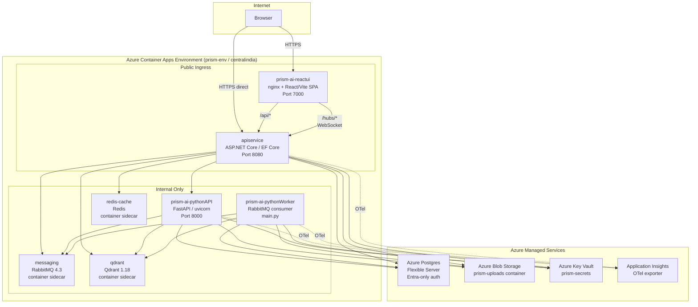

# Deployment & Environment Architecture

> **Single source of truth** for how Prism is deployed, configured, and operated.
> All facts derived from source inspection (2026-09-23). Items marked **NOT VERIFIED** could not be confirmed without running live commands (`az`, `docker`, etc.) — treat them as assumptions until verified.

---

## 1. Current Deployment Architecture

### Runtime Topology



### Service Inventory

| Container App | Image Source | Ingress | Port | Replicas | CPU / Memory | Auth |
|---|---|---|---|---|---|---|
| `prism-ai-reactui` | `Prism.Web/Dockerfile` (nginx) | **Public** | 7000 | NOT VERIFIED | NOT VERIFIED | — |
| `apiservice` | `Prism.ApiService/Dockerfile` | **Public** | 8080 | 1 min / 1 max | Aspire default | Managed Identity |
| `prism-ai-pythonAPI` | `Prism.PythonService/Dockerfile` | Internal | 8000 | 1 min / 1 max | 2.0 / 4Gi | Managed Identity |
| `prism-ai-pythonWorker` | `Prism.PythonService/Dockerfile.worker` | Internal | — (no HTTP) | — | 2.0 / 4Gi | Managed Identity |
| `messaging` | RabbitMQ 4.3 (Aspire-managed) | Internal | — | — | — | Username/password |
| `qdrant` | Qdrant 1.18 (Aspire-managed) | Internal | — | — | — | API key |
| `redis-cache` | Redis (Aspire-managed) | Internal | — | — | — | — |

| Managed Service | Type | Auth |
|---|---|---|
| Azure Postgres Flexible Server | `postgres-udnvqoy3me2bs` | Entra-only (password auth disabled) |
| Azure Blob Storage | `prism-uploads` container | Managed Identity |
| Azure Key Vault | `prism-secrets` | Managed Identity + role assignments |
| Application Insights | OTel exporter swap only | Connection string |

### Key Architecture Constraints

- **All app containers pinned to 1 replica** — no SignalR backplane configured; in-memory group routing requires exactly one `apiservice` instance. (`AppHost.cs` L281-285, `docs/deployment_notes.md` §Replica pin)
- **RabbitMQ runs without a persistent volume in prod** — Azure Files (SMB) doesn't preserve the `0600` permission on `.erlang.cookie` that Erlang requires. Queue state is lost on container restart. (`AppHost.cs` L58-71)
- **Redis provisioned but caching logic not yet implemented** — reserved for future response caching. (`AppHost.cs` L27)

---

## 2. Environment & Configuration

### Configuration Precedence

Configuration sources are resolved differently depending on which layer reads them:

#### Vite / React (build-time only)

```
.env.production  →  baked into static bundle at `npm run build`
                     (VITE_API_BASE_URL, VITE_AZURE_CLIENT_ID, etc.)
```

There is no runtime env var injection for the React app. All `VITE_*` values are frozen at Docker image build time.

| Vite Variable | Value (from `.env.production`) |
|---|---|
| `VITE_API_BASE_URL` | `https://apiservice.nicesky-c6f0b846.centralindia.azurecontainerapps.io` |
| `VITE_AZURE_CLIENT_ID` | `491dccf4-63d7-4929-895e-83784b44ca3d` |
| `VITE_AZURE_AUTHORITY` | `https://prismresearchcloud.ciamlogin.com/...` |
| `VITE_AZURE_REDIRECT_URI` | `https://prism-ai-reactui.nicesky-c6f0b846.centralindia.azurecontainerapps.io/` |

#### Local dev (Aspire F5)

```
dotnet user-secrets  →  appsettings.json  →  Aspire-injected env vars
                                              (services__apiservice__https__0, etc.)
```

Vite dev server resolves API target via: `services__apiservice__https__0` → `services__apiservice__http__0` → `VITE_API_BASE_URL` → `http://localhost:7217` (`vite.config.ts` L12-16).

#### `aspire deploy` (publish mode)

```
.deploy.env (PowerShell env vars)  →  AppHost.cs IsPublishMode branches
                                       →  Azure Key Vault (secretref:)
                                       →  Container App env vars
```

#### Azure runtime

```
Key Vault secrets (via secretref:)    →  for AI_API_KEY, GROQ_API_KEY
Aspire-generated connection strings   →  for ConnectionStrings__prism-db, __messaging, __blobs
AppHost.cs WithEnvironment()          →  for LLM_* vars, RUN_MIGRATIONS_ON_STARTUP, DEPLOYMENT_REGION
Managed Identity (automatic)          →  for Postgres Entra auth, Blob Storage, Key Vault access
```

### Required Environment Variables

| Service | Variable | Source in Prod |
|---|---|---|
| **apiservice** | `ConnectionStrings__prism-db` | Aspire-generated (Entra auth) |
| | `ConnectionStrings__messaging` | Aspire-generated |
| | `ConnectionStrings__storage` | Aspire-generated |
| | `PYTHON_API_URL` | Aspire service reference |
| | `RUN_MIGRATIONS_ON_STARTUP` | `"false"` (AppHost.cs, publish mode) |
| | `CORS_ALLOWED_ORIGINS` | Hardcoded fallback in code if unset |
| | `DEPLOYMENT_REGION` | `"US-East"` (AppHost.cs L261) |
| **pythonAPI / pythonWorker** | `AI_API_KEY` | Key Vault → `secretref:gemini-api-key` |
| | `GROQ_API_KEY` | Key Vault → `secretref:groq-api-key` |
| | `PRISM_DB_USERNAME` | Managed Identity `NameOutputReference` |
| | `PRISM_DB_PASSWORD` | Unset (triggers Entra token auth) |
| | `LLM_EXTRACTION_MODEL` | `gemini-3.6-flash` |
| | `LLM_EXTRACTION_FALLBACK_MODEL` | `gemini-3.1-flash-lite` |
| | `LLM_CLAIM_AUDIT_MODEL` | `gemini-3.6-flash` |
| | `LLM_CLAIM_AUDIT_FALLBACK_MODEL` | `gemini-3.1-flash-lite` |
| | `LLM_GROUNDING_MODEL` | `groq/openai/gpt-oss-20b` |
| | `LLM_GROUNDING_FALLBACK_MODEL` | `gemini/gemini-3.1-flash-lite` |
| | `LLM_CHAT_MODEL` | `gemini-3.6-flash` |
| | `LLM_ROUTER_MODEL` | `gemini-3.5-flash-lite` |
| | `LLM_SUMMARY_MODEL` | `gemini-3.5-flash-lite` |
| | `ConnectionStrings__messaging` | Aspire-generated |
| | `ConnectionStrings__blobs` | Aspire-generated (service-level, not container-level) |
| **reactUI** | `VITE_API_BASE_URL` | Build-time only (`.env.production`) |

### Secrets Management

| Secret | Local Dev | Deploy Time | Prod Runtime |
|---|---|---|---|
| Google API Key | `dotnet user-secrets` → `Parameters:GoogleApiKey` | `.deploy.env` → `Parameters__GoogleApiKey` | Key Vault → `secretref:gemini-api-key` |
| Groq API Key | `dotnet user-secrets` → `Parameters:GroqApiKey` | `.deploy.env` → `Parameters__GroqApiKey` | Key Vault → `secretref:groq-api-key` |
| RabbitMQ creds | `dotnet user-secrets` | `.deploy.env` → `Parameters__rabbitmquser/pass` | Aspire-generated |
| Qdrant API Key | `dotnet user-secrets` | `.deploy.env` → `Parameters__QdrantApiKey` | Aspire-generated |
| Postgres | Auto-generated by Aspire (local container) | N/A (Entra-only) | Managed Identity token |
| SystemAdminToken | Optional (unset = 403 on `/api/system/reset`) | Container App secret | Container App secret |

> **⚠️ `.deploy.env` is gitignored but contains real API keys when populated. `.deploy.env.template` is the committed template.**

---

## 3. Deployment Workflow

### Backend Services — `aspire deploy`

```
Prism.AppHost/ → aspire deploy
                 ├── apiservice        (Prism.ApiService/Dockerfile)
                 ├── prism-ai-pythonAPI (Prism.PythonService/Dockerfile)
                 ├── prism-ai-pythonWorker (Prism.PythonService/Dockerfile.worker)
                 ├── messaging         (RabbitMQ container, Aspire-managed)
                 ├── qdrant            (Qdrant container, Aspire-managed)
                 ├── redis-cache       (Redis container, Aspire-managed)
                 ├── postgres          (Azure Postgres Flexible Server, provisioned)
                 └── storage           (Azure Blob Storage, provisioned)
```

**Pre-deploy steps:**
1. Fill `.deploy.env` from `.deploy.env.template` with real secret values
2. Source it: `. .\.deploy.env`
3. Run: `aspire deploy` from `Prism.AppHost/`

Aspire generates Bicep at deploy time (no `.bicep` files are committed to the repo). Key Vault, managed identities, and role assignments are provisioned automatically.

---

### ⚠️ reactUI — Separate Manual Deploy (`deploy.ps1`)

> **This is the single most important deployment divergence.** The React frontend is **not deployed by `aspire deploy`**. It requires a completely separate manual process.

**Root cause:** Aspire's publish pipeline deadlocks on `WithBuildArg` in publish mode for the `AddNpmApp`/`AddJavaScriptApp` + `PublishAsDockerFile` combination. This was confirmed across three separate code paths and is an upstream Aspire bug, not a Prism issue. (`docs/decisions.md`, PR5 entry)

**`Prism.Web/deploy.ps1` — exact steps:**

| Step | What it does |
|---|---|
| 1. Branch check | Aborts if not on `main` |
| 2. Clean tree check | Aborts if working tree is dirty |
| 3. `git pull` | Ensures latest `main` |
| 4. nginx preflight | Verifies `nginx.conf` contains `listen 7000;` |
| 5. Docker build | `docker build --no-cache` → tagged `prismenvacrudnvqoy3me2bs.azurecr.io/prism-ai-reactui:latest` |
| 6. Image verification | Runs the built image and greps for `listen 7000` in the container's nginx config |
| 7. ACR push | `az acr login` → `docker push` (always `:latest` tag) |
| 8. Container App update | `az containerapp update` with timestamp-based `--revision-suffix` |
| 9. Health wait | 60-second sleep, then `az containerapp revision list` to show active revision |

**Key facts:**
- The ACR image tag is **always `:latest`** — no versioned tags are built or pushed
- Revision uniqueness comes from the `--revision-suffix` (timestamp), not the image tag
- The script runs from `Prism.Web/` (nginx.conf path is relative)
- `VITE_API_BASE_URL` is baked into the image at build time from `.env.production`, not passed as a runtime env var

---

## 4. Live Evaluation

### `eval-live.ps1`

**Location:** `Prism.PythonService/eval-live.ps1`

**What it does:** Runs the eval matrix against the **live production database** — not a deployment verifier.

| Step | Action |
|---|---|
| 1 | Reads local `Prism.PythonService/.env` |
| 2 | Comments out `PRISM_DB_PASSWORD` (forces Entra token auth path) |
| 3 | Sets `PRISM_DB_HOST` → live Azure Postgres hostname |
| 4 | Sets `PRISM_DB_USERNAME` → live Entra principal |
| 5 | Runs `uv run python -m eval.matrix_runner --source db` |
| 6 | Restores original `.env` in `finally` block |

**What it validates:** Whether claims extracted and stored in the live database pass the eval matrix thresholds. This is a **quality gate on production data**, not an infrastructure health check.

### "Deployed" vs "Eval Passed" — Hard Distinction

| State | Meaning | How to reach |
|---|---|---|
| **Deployed** | Container App revision is active and healthy | `aspire deploy` + `deploy.ps1` complete without error |
| **Eval passed** | Live-extracted claims meet quality thresholds | `eval-live.ps1` runs successfully post-deploy |

A deploy can succeed while eval fails (e.g., a prompt change degrades extraction quality). Conversely, eval can pass on data produced by a prior deploy — it reads whatever is in the database, regardless of which code version produced it.

### CI Eval (GitHub Actions)

The only CI pipeline is `.github/workflows/eval.yml`, which runs **fixture-only** eval on PR/push to `main`:
- `uv run pytest eval/tests/ -v`
- `uv run python -m eval.check_fixture_freshness`
- `uv run python -m eval.matrix_runner --source fixture`

No live services are contacted. No deployment is triggered.

---

## 5. API & Network Boundaries

### Public Endpoints

| URL | Service | Purpose |
|---|---|---|
| `https://prism-ai-reactui.nicesky-c6f0b846.centralindia.azurecontainerapps.io/` | reactUI | SPA frontend |
| `https://apiservice.nicesky-c6f0b846.centralindia.azurecontainerapps.io/` | apiservice | REST API + SignalR hub |

### nginx Routing (reactUI → apiservice)

| Path | Behavior | Timeout |
|---|---|---|
| `/api/*` | Reverse proxy → apiservice | read 300s, connect 30s |
| `/hubs/*` | WebSocket proxy → apiservice (SignalR) | read/send 3600s |
| `/health` | Returns `200 "healthy\n"` (no upstream) | — |
| `~* \.(css\|js\|woff2?\|...)$` | Static assets, `Cache-Control: immutable, max-age=1y` | — |
| `= /index.html` | `no-store, no-cache` (always fresh SPA shell) | — |
| `/` (fallback) | `try_files $uri $uri/ /index.html` (SPA routing) | — |

The `__VITE_API_BASE_URL__` placeholder in `nginx.conf` is replaced at Docker build time by the Dockerfile's `sed` command, reading from `.env.production`. The resolved value is `https://apiservice.nicesky-c6f0b846.centralindia.azurecontainerapps.io`.

### Internal Service Communication

| From | To | Protocol | How resolved |
|---|---|---|---|
| apiservice | pythonAPI | HTTP | Aspire service reference (`WithReference(pythonAPI.GetEndpoint("pythonapi"))`) |
| apiservice | postgres | TCP/5432 | Aspire connection string (Entra auth, Npgsql) |
| apiservice | RabbitMQ | AMQP | Aspire connection string (`ConnectionStrings__messaging`) |
| apiservice | Blob Storage | HTTPS | Aspire connection string (`ConnectionStrings__storage`) — container-level (`uploads`) |
| apiservice | Qdrant | HTTP | Aspire connection string |
| pythonAPI/Worker | postgres | TCP/5432 | Entra token via `PRISM_DB_USERNAME` + `DefaultAzureCredential` |
| pythonAPI/Worker | RabbitMQ | AMQP | Aspire connection string (`ConnectionStrings__messaging`) |
| pythonAPI/Worker | Blob Storage | HTTPS | Aspire connection string (`ConnectionStrings__blobs`) — service-level (not container-level) |
| pythonAPI/Worker | Qdrant | HTTP | `QDRANT_HTTPURI` + `QDRANT_APIKEY` (raw env vars, not yet in `config.py`) |
| pythonAPI/Worker | Gemini | HTTPS | `AI_API_KEY` from Key Vault |
| pythonAPI/Worker | Groq | HTTPS | `GROQ_API_KEY` from Key Vault |

> **Note on Blob Storage references:** C# `apiservice` references the `uploads` container child resource (Aspire's decorated connection string with `;ContainerName=prism-uploads`). Python references the `blobs` service-level resource (plain connection string) and targets `prism-uploads` by name explicitly. These are **not interchangeable**. (`AppHost.cs` L121-132)

### CORS Configuration

**Prod (non-Development):**
```
CORS_ALLOWED_ORIGINS env var → if unset, falls back to:
  https://prism-ai-reactui.nicesky-c6f0b846.centralindia.azurecontainerapps.io
```

**Dev (IsDevelopment):**
```
CORS_ALLOWED_ORIGINS env var → if unset, falls back to:
  http://localhost:5173, http://localhost:7000
```

The previously documented `localhost:7000`/`localhost:5173` CORS mismatch is **resolved** — both origins are present in the dev fallback array (`Program.cs` L148-150). The CORS policy name is `"SignalRPolicy"` and allows any header, any method, with credentials.

### Health Checks

| Service | Endpoint | Type | Dependencies checked |
|---|---|---|---|
| reactUI (nginx) | `/health` | Liveness | None (returns 200) |
| apiservice | `/health` | Liveness | None |
| pythonAPI | `/health` | Liveness | None |
| All services | `/readiness` | — | **Not implemented** (post-V1) |

---

## 6. Developer Workflow

### Change → Deploy Matrix

| Change Type | What to do | reactUI | apiservice / pythonAPI / pythonWorker |
|---|---|---|---|
| **Restart Only** | Config change, env var tweak | N/A — static bundle, no runtime env | `az containerapp revision restart` |
| **Local Rebuild** | Code change, test locally | `npm run dev` (Vite HMR) | `dotnet run` / `uv run` via Aspire F5 |
| **Container Rebuild** | Verify Docker image works | `docker build` locally | `docker build` locally |
| **Redeploy** | Push to production | **`Prism.Web/deploy.ps1`** (manual, from `main`) | **`aspire deploy`** (from `Prism.AppHost/`) |
| **Live Eval** | Verify extraction quality on prod data | N/A | `Prism.PythonService/eval-live.ps1` |

### ⚠️ reactUI Exception

| Aspect | reactUI | Other 3 services |
|---|---|---|
| Deploy mechanism | `Prism.Web/deploy.ps1` (manual docker+az) | `aspire deploy` |
| Image tagging | Always `:latest` | Aspire-managed tags |
| Config injection | Build-time only (`.env.production` → Vite → nginx) | Runtime (Key Vault, Aspire env vars) |
| Aspire publish | **Not picked up** (`AddJavaScriptApp` has no ACA publish path) | Fully managed |
| nginx.conf | Custom, committed to repo | N/A |
| Why separate | Aspire `WithBuildArg` deadlocks in publish mode | N/A |

### Post-Deploy Verification

After any deploy, **always** verify actual running state:
```powershell
# Shows ACTUAL running revision (not desired config)
az containerapp revision list `
  --name <app-name> `
  --resource-group prism-rg `
  --query "[?properties.active]"
```

Never trust `az containerapp show --query "properties.template..."` — that shows **desired** config, not what's actually live.

---

## 7. Known Issues & Recovery

Pulled from `docs/RUNBOOK.md` and `docs/decisions.md`. All entries are confirmed from source.

### Deployment Failure Modes

| # | Symptom | Likely Cause | Verification | Recovery |
|---|---|---|---|---|
| 1 | `MANIFEST_UNKNOWN` on image pull; `docker push` succeeds but tag doesn't appear in ACR | Docker Desktop DNS/proxy stuck between pushes | `az acr repository show-tags --name <acr>` — tag missing | Use `az acr build` instead of local Docker: `az acr build --registry <acr> --image "<repo>:<tag>" --file <Dockerfile> .` (builds in Azure, bypasses local Docker) |
| 2 | Worker was Healthy, then Activating. System logs show `exit code '137'` and `ProcessExited` | OOMKilled — embedding model + PDF + concurrent LLM calls exceed memory. Two concurrent papers enough to OOM at 4Gi | `az containerapp logs show --type system` — look for exit 137 | `az containerapp update -n prism-ai-pythonworker -g prism-rg --cpu 4.0 --memory 8Gi` (ACA rule: memory = 2× CPU). Root fix: reduce `AUDIT_CONCURRENCY` or prefetch |
| 3 | Revision shows Healthy but serves old code / old behavior | `properties.template` shows desired config, not actual running state | `az containerapp revision list --query "[?properties.active]"` — compare revision name/image | Force new revision: `az containerapp update` with new `--revision-suffix` |
| 4 | After Postgres reset, API is healthy but requests fail with missing-table / relation errors | `RUN_MIGRATIONS_ON_STARTUP=false` in prod — empty DB never migrated | Check container logs for EF Core migration-applied lines (absent = never ran) | `az containerapp update -n apiservice -g prism-rg --set-env-vars RUN_MIGRATIONS_ON_STARTUP=true`, verify migrations ran, optionally flip back to `false` |
| 5 | `PrismSettings` field rename crashes on boot | Two-step deploy required when renaming settings fields | Service won't start — check container logs for binding errors | See RUNBOOK §"PrismSettings field rename" |

### Local Dev Failure Modes

| # | Symptom | Likely Cause | Verification | Recovery |
|---|---|---|---|---|
| 6 | Postgres container starts but services fail with auth / password errors | Aspire auto-generated passwords drifted from persisted Docker volume | Password mismatch in container logs | `docker volume rm <postgres-volume>`, relaunch Aspire |
| 7 | `429 ResourceExhausted` errors or extraction freezes | Gemini free-tier quota exhausted (15 RPM, 1500 RPD) | [Google AI Studio Console](https://aistudio.google.com/) quota charts | Wait for daily reset or switch to paid key |
| 8 | API calls to Qdrant/RabbitMQ/MinIO fail from scripts | Aspire assigns random dynamic ports per startup | Check Aspire Dashboard **Endpoints** column | Use the port shown in the current Aspire Dashboard run |
| 9 | PowerShell `curl` produces JSON parse errors | `curl` is aliased to `Invoke-WebRequest` in PowerShell | Error message mentions target invocation | Use `curl.exe` with JSON piped via `ConvertTo-Json \| curl.exe -d @-` |
| 10 | Code changes have no effect after restart | Visual Studio debugger file lock on DLL | `dotnet.exe` processes still running | Detach/close debugger, kill `dotnet.exe` processes |
| 11 | AppHost crashes with "Sequence contains more than one matching element" | Manual `docker restart` on Aspire-managed container caused duplicate DCP resource | Aspire.Hosting.Dcp.DcpExecutor in crash log | Never manually `docker restart` Aspire containers. Use Aspire dashboard lifecycle commands only |
| 12 | Eval / extraction hangs silently | Postgres connection pool exhaustion (observed after DCP crash) | Check eval output file sizes (0 = hung) | Verify connection leaks, restart Postgres via Aspire |

---

## 8. Future Direction

> **Everything in this section is labeled FUTURE — none of it exists today.**

### CI/CD Pipeline — FUTURE

No automated deploy pipeline exists. The only CI workflow is `.github/workflows/eval.yml` (fixture-only eval on PR/push to `main`). All deployments are manual.

**FUTURE:** A GitHub Actions deploy workflow would need to handle the two-track divergence:
- Backend services via `aspire deploy` (requires Azure credentials, `.deploy.env` equivalent)
- reactUI via the `deploy.ps1` flow (requires Docker, ACR login, `az containerapp update`)

### Versioned Image Tags — FUTURE

reactUI is always tagged `:latest` on ACR. **FUTURE:** Versioned tags (e.g., git SHA or semver) would enable rollback without rebuild and audit trail of which code is in which image.

### `PublishAsDockerFile` for reactUI — FUTURE

The root fix to eliminate the two-track deploy is making Aspire's publish pipeline handle reactUI natively. Tracked as "v1.0.2" in README.md. Requires fixing the `WithBuildArg` deadlock upstream in Aspire, or working around it by baking `VITE_API_BASE_URL` via `.env.production` (already done) and dropping `WithBuildArg` entirely.

### Environment Separation — FUTURE

Currently a single Azure environment (`prism-env` / `prism-rg` / `centralindia`). No staging, no preview environments. **FUTURE:** Separate environments would enable pre-prod validation of `aspire deploy` changes before they hit production.

### Observability — FUTURE

Application Insights is wired (OTel exporter) but readiness probes (`/readiness` with DB/Qdrant pings) are post-V1. Redis caching logic is provisioned but not implemented.

### SignalR Backplane — FUTURE

Currently no SignalR backplane — in-memory group routing requires exactly 1 `apiservice` replica. **FUTURE:** Redis backplane would enable horizontal scaling of `apiservice`.

### Service Bus Migration — FUTURE

RabbitMQ swap to Azure Service Bus was attempted and reverted (4 bugs in Aspire ServiceBus emulator + Python SDK, including upstream `microsoft/aspire#14041`). Deferred to its own PR. MassTransit abstraction on the C# side means the swap is a config change; Python consumer needs a scoped port.

---

## Change Summary

### What was inspected
- `README.md`, `docs/decisions.md` (relevant sections), `docs/RUNBOOK.md`, `docs/deployment_notes.md`
- `Prism.AppHost/AppHost.cs`, `Prism.AppHost/.deploy.env.template`, `Prism.AppHost/.deploy.env`
- `Prism.Web/deploy.ps1`, `Prism.Web/Dockerfile`, `Prism.Web/nginx.conf`, `Prism.Web/.env.production`, `Prism.Web/vite.config.ts`
- `Prism.ApiService/Dockerfile`, `Prism.ApiService/Program.cs` (CORS section)
- `Prism.PythonService/Dockerfile`, `Prism.PythonService/Dockerfile.worker`, `Prism.PythonService/eval-live.ps1`
- `.github/workflows/eval.yml`
- Git branch history (merge status of `fix/entra-api-token-audience-scope`, `fix/entra-idx10511-and-deploy-hardening`)

### What was written
- `docs/deployment-and-environment-architecture.md` (this file)

### NOT VERIFIED items
| Item | Why | How to verify |
|---|---|---|
| reactUI replica count / CPU / memory in prod | Not declared in AppHost.cs (reactUI not managed by Aspire publish) | `az containerapp show -n prism-ai-reactui -g prism-rg` |
| Whether live image matches current `main` HEAD | Would require ACR tag inspection or revision metadata | `az containerapp revision list` + `az acr repository show-tags` |
| Current live value of `RUN_MIGRATIONS_ON_STARTUP` | Manual `az containerapp update` override may be active | `az containerapp show -n apiservice -g prism-rg --query "properties.template.containers[0].env"` |
| Aspire dashboard accessibility in prod | Code says no public ingress, but not verified live | `az containerapp env dashboard show` |
| `CORS_ALLOWED_ORIGINS` env var set on live apiservice | Code has a hardcoded fallback; unclear if env var is also set | `az containerapp show` env inspection |
