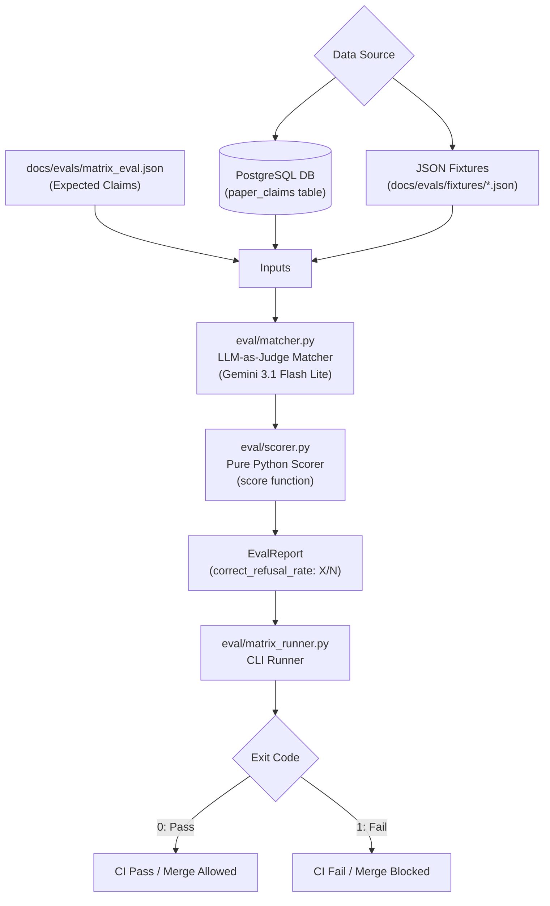
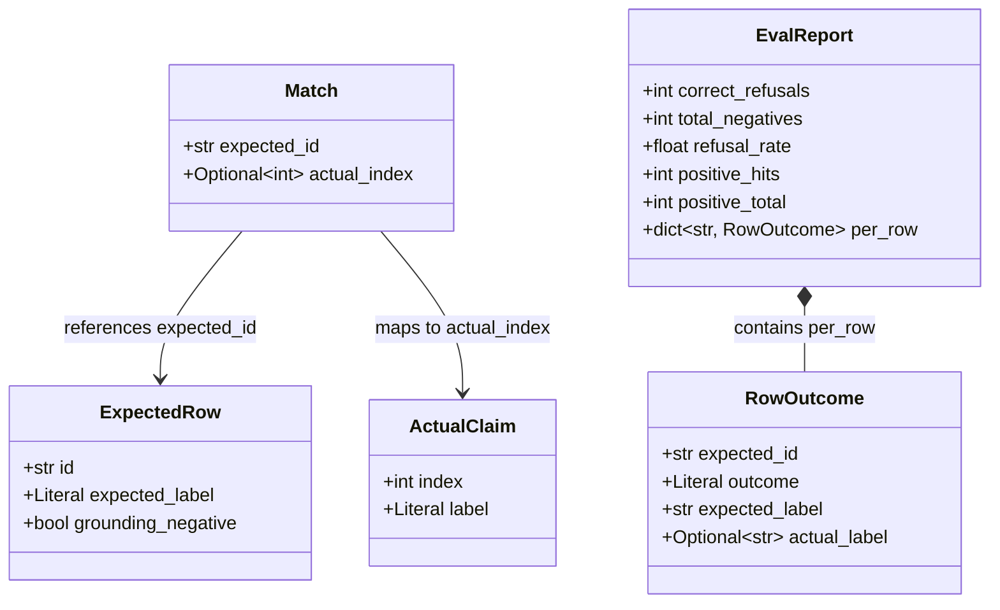
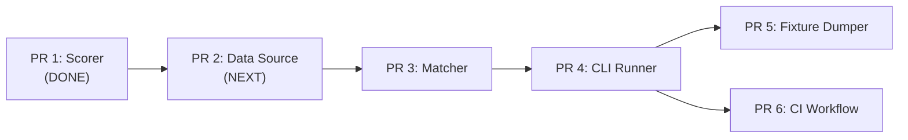
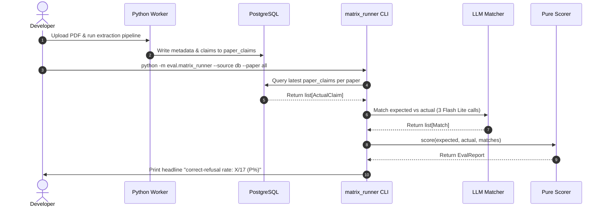
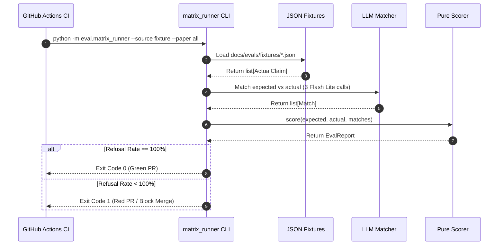

# The Prism Eval Harness

## 1. Why this exists

Prism is an AI system that audits research papers by checking whether the paper's headline claims are actually backed up by evidence inside the paper text.

In traditional search tools (like Elicit or Consensus), the goal is to find relevant papers and summarize them. Prism does something harder: it acts as a peer reviewer. Its core product bet is **correct refusal** — refusing to affirm claims that a paper does not actually support, even if the paper's authors claim it loudly in their Abstract.

A claim-auditing tool that fabricates support for unbacked claims is dangerous to researchers. If Prism says a claim is supported when the paper offers no evidence for it, the system has failed its primary job. Therefore, the single headline metric that measures whether Prism works is:

**`correct-refusal rate: X/N (P%)`**

- **Correct refusal rate**: The percentage of invalid or overstated claims that the AI system correctly identifies as unsupported or partially supported, rather than falsely validating them.
- **Grounding-negative**: A test case containing a claim that is unsupported, exaggerated, or missing direct experimental evidence in the paper, requiring the engine to refuse to validate it.
- **Eval harness**: An automated testing script and scoring pipeline that executes AI outputs against ground-truth benchmarks to measure performance.

### Headline metric explained

This number represents the percentage of negative or overstated test claims across our evaluation dataset that Prism's extraction engine successfully refused to validate as fully supported. 

Why is this number the central interview slide for the repository? Because anyone can prompt an LLM to generate a plausible-sounding summary. The engineering challenge in production AI systems is constraining the LLM so it admits when evidence is missing. A reproducible eval harness emitting a clean `correct-refusal rate` proves that the system's trustworthiness is measured, tracked, and protected against regressions.

### Analogy & Explain to a Kid

> [!NOTE]
> **Real-World Analogy**: Think of a pharmacy reviewer checking drug claims. If a drug company claims their pill cures headaches, a good reviewer checks the clinical data. If the data isn't in the study, a bad reviewer guesses "looks fine!", while a rigorous reviewer stamps it "UNSUPPORTED". The eval harness measures how often our reviewer correctly stamps "UNSUPPORTED" when data is missing.

> [!TIP]
> **Explain to a Kid**: Imagine your friend tells you they can jump over a house. A silly robot believes them right away. A smart robot says, "Show me a video of you jumping over the house first!" If there's no video, the smart robot says "I don't believe you yet." The eval harness counts how many times our smart robot caught people making up big stories.

---

## 2. What it is (and what it is NOT)

To keep the harness lean and effective, we maintain strict boundaries on its purpose:

- **IS**:
  - A deterministic **regression gate** (an automated check in a continuous integration pipeline that blocks code changes if performance drops below a specified threshold) for prompt, model, and retrieval changes.
  - A repeatable measurement tool that produces a single score (`correct-refusal rate: X/N (P%)`).
  - A local CLI and CI workflow that executes against committed ground-truth JSON files.
  - A standard Python package residing in `Prism.PythonService/eval/`.

- **IS NOT**:
  - A model training loop (Prism uses frozen LLMs via API; we do not update weights).
  - A general-purpose unit test suite (standard pytest unit tests live alongside modules for code logic).
  - A public benchmark paper or dataset we intend to publish to HuggingFace or arXiv.
  - A customer-facing UI feature or runtime API endpoint.

---

## 3. The 30-second mental model

The eval harness works by comparing what we expect Prism to extract against what Prism actually extracts from a set of research papers. Ground-truth expected claims live in `docs/evals/matrix_eval.json`. Actual claims are fetched either directly from PostgreSQL (for local testing) or from committed JSON fixtures (for fast CI testing). An LLM-as-judge matcher pairs each expected claim to an actual claim based on semantic meaning. A pure Python scorer compares the paired labels against our refusal rules, emits an `EvalReport`, and exits with code `0` (pass threshold met) or `1` (fail, blocking CI).



- **LLM-as-judge**: Using a Large Language Model to evaluate or match text outputs based on semantic meaning rather than exact string matching.

---

## 4. The two files that define ground truth

Ground-truth evaluation data in Prism is split into two specialized JSON files located in `docs/evals/`.

### 4.1 matrix_eval.json

- **Location**: `docs/evals/matrix_eval.json`
- **Purpose**: Ground-truth benchmark for the **Claim-Support Matrix** (Tier-1 extraction engine). It evaluates whether empirical claims extracted from paper PDFs are correctly labeled as `supported`, `partially_supported`, or `not_supported`.
- **Contents**: 37 total rows spanning 3 foundational agent papers:
  1. *Reflexion: Language Agents with Verbal Reinforcement Learning* (Shinn et al., `arxiv-2303.11366v4`) — 12 matrix rows.
  2. *Chain-of-Thought Prompting Elicits Reasoning in Large Language Models* (Wei et al., `arxiv-2201.11903v6`) — 12 matrix rows.
  3. *ReAct: Synergizing Reasoning and Acting in Language Models* (Yao et al., `arxiv-2210.03629v3`) — 13 matrix rows.
- **Negative cases**: 14 of the 37 matrix rows have `grounding_negative: true` (or `expected_label: "not_supported"`). These negative cases represent claims where abstract assertions exaggerate experimental findings, baseline comparisons are missing, or generalizations exceed data.

#### Row Schema in Plain English

Each row in `matrix_eval.json` represents a specific claim that a human reviewer audited from the paper:
- `id`: Unique identifier (e.g., `REFLEX-M11`).
- `claim_text_verbatim`: Exact sentence or quote as written in the paper text.
- `claim_summary`: 10-15 word standardized summary used for semantic matching.
- `expected_label`: The true grounding label (`supported`, `partially_supported`, or `not_supported`).
- `expected_evidence_sections`: List of sections/tables where backing evidence should appear (empty if `not_supported`).
- `grounding_negative`: Boolean flag indicating if this is a negative probe case requiring refusal.
- `scoring_notes`: Human reviewer rationale detailing why the claim receives this label.
- `why_this_case`: High-level explanation of the rhetorical flaw or audit goal tested by this row.
- `confidence`: Reviewer confidence score (0.0 to 1.0).

#### Real Row Example (`REFLEX-M11`)

Here is an actual grounding-negative row from `docs/evals/matrix_eval.json`:

```json
{
  "id": "REFLEX-M11",
  "claim_text_verbatim": "traditional reinforcement learning methods require extensive training samples and expensive model fine-tuning. We propose Reflexion, a novel framework to reinforce language agents not by updating weights, but instead through linguistic feedback.",
  "claim_summary": "Reflexion is more sample-efficient and computationally cheaper than traditional reinforcement learning methods.",
  "expected_label": "not_supported",
  "expected_evidence_sections": [],
  "grounding_negative": true,
  "scoring_notes": "Matches Pattern 1 (Comparative claim without the comparison). The abstract implies Reflexion is more sample-efficient than traditional RL methods (like PPO). However, the experiments section only compares Reflexion against other frozen LLM prompting techniques (ReAct, CoT) and NEVER benchmarks it against a traditional RL agent to prove superior sample efficiency.",
  "why_this_case": "Classic unsupported comparative claim from the abstract.",
  "confidence": 0.90
}
```

### 4.2 golden_eval.json

- **Location**: `docs/evals/golden_eval.json`
- **Purpose**: Ground-truth benchmark for the **CRAG Chat Pipeline** (interactive QA over paper chunks), evaluating end-to-end question answering and retrieval refusal.
- **Contents**: 21 questions across the same 3 papers (9 factual, 6 table extraction, 3 reasoning aggregation, 3 grounding negative).
- **Distinction**: 
  - `matrix_eval.json` tests **Claim Extraction**: "Did the worker correctly extract and ground every empirical claim in the PDF?"
  - `golden_eval.json` tests **Interactive Chat**: "When a user asks a question about the paper in the chat UI, does the LangGraph agent answer accurately or refuse correctly if the paper contains no answer?"
- **CRAG (Corrective Retrieval-Augmented Generation)**: A RAG architecture that evaluates retrieved context for relevance and dynamically handles ungrounded user queries.

Both datasets share the same 3 foundational papers, but evaluate distinct runtime pipelines.

---

## 5. Scoring model — how PASS/FAIL is decided

The scoring logic is implemented as a pure function in `Prism.PythonService/eval/scorer.py`.

### 5.1 Negative Rows & The Refusal Denominator

The headline metric is computed over all negative probe cases.

$$\text{Denominator } N = \text{Count of rows where } (\text{grounding\_negative} = \text{True} \lor \text{expected\_label} = \text{"not\_supported"})$$

Across the complete test suit suite, there are **17 combined negative probe points** (14 in `matrix_eval.json` + 3 in `golden_eval.json`).

For each negative row in `matrix_eval.json`:

1. **PASS**: If the extraction engine emitted a matching claim labeled as `not_supported` or `partially_supported`.
2. **PASS (Refusal by Omission)**: If the extraction engine emitted **no matching claim** for this row at all.
3. **FAIL**: If the extraction engine emitted a matching claim and labeled it as `supported`.

- **Refusal by omission**: A pass condition where the engine completely omits an unsupported claim from its extraction output rather than labeling it as supported.

### 5.2 Positive Rows

Rows where `grounding_negative = False` and `expected_label = "supported"` are scored separately:
- **POSITIVE_HIT**: The engine extracted the claim and labeled it `supported`.
- **POSITIVE_MISS**: The engine failed to extract the claim or labeled it non-supported.

Positive rows are reported in the `EvalReport` (`positive_hits / positive_total`), but **they do not affect the headline `correct-refusal rate`**.

### 5.3 Asymmetric Scoring Rationale

Why is the scoring model asymmetric?

In a claim-auditing tool, missing a valid claim (`POSITIVE_MISS`) is a minor recall loss. Fabricating support for an unbacked claim (`FAIL` on a negative row) is fatal to user trust. If Prism tells a researcher "This paper proves X" when the paper actually provides zero evidence for X, the researcher risks citing a false claim in peer-reviewed literature. Therefore, negative rows act as strict veto gates, while positive rows provide secondary quality metrics.

> [!NOTE]
> **Real-World Analogy**: Think of a airport security scanner. Missing a forgotten water bottle in a bag is annoying. Missing an explosive device is catastrophic. The scanner is tuned with asymmetric strictness to prevent the fatal error above all else.

> [!TIP]
> **Explain to a Kid**: Imagine a guard dog. If the dog sleeps while a friendly postman walks by, nobody minds much. But if the dog wags its tail and lets a sneaky robber inside, the dog failed its only job!

### 5.4 Worked Example

Consider an eval run over 3 rows from `matrix_eval.json`:

| Row ID | `expected_label` | `grounding_negative` | Engine Output (`actual_label`) | Scorer Match | Result | Rationale |
| :--- | :--- | :--- | :--- | :--- | :--- | :--- |
| `REFLEX-M01` | `supported` | `false` | `supported` | Matched (`index=0`) | **POSITIVE_HIT** | Positive claim correctly extracted. |
| `REFLEX-M11` | `not_supported` | `true` | *None* (omitted) | Unmatched (`actual_index=None`) | **PASS** | Refusal by omission; unbacked claim was ignored by engine. |
| `REFLEX-M12` | `not_supported` | `true` | `supported` | Matched (`index=3`) | **FAIL** | Engine hallucinated support for an unbacked claim. |

**Scoring Calculation**:
- Total Negatives ($N$) = 2 (`REFLEX-M11`, `REFLEX-M12`)
- Correct Refusals = 1 (`REFLEX-M11`)
- **Headline Refusal Rate** = $1 / 2 = 50.0\%$
- Positive Hits = 1 / 1 ($100\%$)

---

## 6. Data shapes flowing through the harness

All data structures used during evaluation are defined using Pydantic in `Prism.PythonService/eval/types.py`.



### 6.1 ExpectedRow
- **Represents**: One ground-truth claim row loaded from `docs/evals/matrix_eval.json`.
- **Source**: Parsed from `matrix_eval.json` by the runner CLI.
- **Fields**:
  - `id: str`: Unique row ID (e.g., `"REFLEX-M11"`).
  - `expected_label: Literal["supported", "partially_supported", "not_supported"]`: True label.
  - `grounding_negative: bool`: Whether this row tests refusal capability.

```json
{
  "id": "REFLEX-M11",
  "expected_label": "not_supported",
  "grounding_negative": true
}
```

### 6.2 ActualClaim
- **Represents**: One claim extracted by Prism's Python extraction engine.
- **Source**: Fetched from PostgreSQL (`paper_claims` table) or read from a JSON fixture file.
- **Fields**:
  - `index: int`: Zero-based index of the claim in the extraction run list.
  - `label: Literal["supported", "partially_supported", "not_supported"]`: Label assigned by Gemini during extraction.

```json
{
  "index": 0,
  "label": "supported"
}
```

### 6.3 Match
- **Represents**: The pairing between an `ExpectedRow` and an `ActualClaim`, established by the LLM matcher.
- **Source**: Produced by `eval/matcher.py` (LLM-as-judge).
- **Fields**:
  - `expected_id: str`: ID of the expected row.
  - `actual_index: Optional[int]`: Index of the matched actual claim (or `None` if the engine emitted no matching claim).

```json
{
  "expected_id": "REFLEX-M11",
  "actual_index": null
}
```

### 6.4 RowOutcome
- **Represents**: The evaluation result for a single expected row.
- **Source**: Computed by `eval/scorer.py`.
- **Fields**:
  - `expected_id: str`: ID of the expected row.
  - `outcome: Literal["PASS", "FAIL", "POSITIVE_HIT", "POSITIVE_MISS"]`: Scored outcome.
  - `expected_label: str`: Expected ground-truth label.
  - `actual_label: Optional[str]`: Label of the matched actual claim, or `None`.

```json
{
  "expected_id": "REFLEX-M11",
  "outcome": "PASS",
  "expected_label": "not_supported",
  "actual_label": null
}
```

### 6.5 EvalReport
- **Represents**: The aggregate evaluation metrics across all rows in the benchmark run.
- **Source**: Returned by `score()` in `eval/scorer.py`.
- **Fields**:
  - `correct_refusals: int`: Number of negative rows passed.
  - `total_negatives: int`: Total number of negative rows evaluated.
  - `refusal_rate: float`: `correct_refusals / total_negatives` (0.0 to 1.0).
  - `positive_hits: int`: Number of positive rows matched with `supported`.
  - `positive_total: int`: Total number of positive rows.
  - `per_row: dict[str, RowOutcome]`: Map of row IDs to individual outcomes.

```json
{
  "correct_refusals": 14,
  "total_negatives": 14,
  "refusal_rate": 1.0,
  "positive_hits": 20,
  "positive_total": 23,
  "per_row": {
    "REFLEX-M11": {
      "expected_id": "REFLEX-M11",
      "outcome": "PASS",
      "expected_label": "not_supported",
      "actual_label": null
    }
  }
}
```

---

## 7. The pipeline in six PRs

The eval harness build is structured into six modular, sequential PRs to ensure incremental testing and clean architectural boundaries.



### PR 1 — Scorer (DONE — in `feat/eval-scorer`)
- **Files**: `Prism.PythonService/eval/types.py`, `Prism.PythonService/eval/scorer.py`, `Prism.PythonService/eval/tests/test_scorer.py`
- **What it adds**: Pure scoring logic and Pydantic schemas. Computes `refusal_rate` and per-row outcomes.
- **Dependencies**: None (pure Python, Pydantic).
- **Inputs**: `list[ExpectedRow]`, `list[ActualClaim]`, `list[Match]`.
- **Outputs**: `EvalReport`.

### PR 2 — DB reader + fixture reader (NEXT)
- **Files**: `Prism.PythonService/eval/data_source.py`
- **What it adds**: Two data-loading functions returning identical return shapes: `read_from_db(filename: str)` and `read_from_fixture(path: Path)`. Both return `list[ActualClaim]`.
- **Dependencies**: PR 1 (`ActualClaim` schema), `psycopg3` pool from `memory_db.py`.
- **Inputs**: Paper filename or fixture file path.
- **Outputs**: `list[ActualClaim]`.
- **Database Query**: Fetches the latest extraction run for a paper by ordering `document_extractors` by `created_at DESC` and joining `paper_claims`:
  ```sql
  SELECT pc.claim_text_verbatim, pc.claim_summary, pc.label
  FROM document_extractors de
  JOIN paper_claims pc ON pc.document_extractor_id = de.id
  WHERE de.file_id = (SELECT id FROM uploaded_files WHERE filename = %s ORDER BY created_at DESC LIMIT 1)
  ORDER BY pc.created_at ASC;
  ```

### PR 3 — Matcher (LLM-as-judge)
- **Files**: `Prism.PythonService/eval/matcher.py`
- **What it adds**: Semantic claim matching using Gemini 3.1 Flash Lite (`google-genai`). Pairs expected matrix rows to actual extracted claims.
- **Dependencies**: PR 1 (`ExpectedRow`, `ActualClaim`, `Match`).
- **Optimization**: Batched call per paper — sends all expected rows and actual claims for one paper in **1 LLM call** (3 total calls per eval run across 3 papers). Avoids per-pair calls ($37 \times 15 = 555+$ calls) which would exhaust rate limits.
- **Inputs**: `list[ExpectedRow]` and `list[ActualClaim]` for a paper.
- **Outputs**: `list[Match]`.

### PR 4 — matrix_runner CLI
- **Files**: `Prism.PythonService/eval/matrix_runner.py`
- **What it adds**: CLI entry point executing the full eval loop. Accepts `--source db|fixture` and `--paper reflexion|cot|react|all`.
- **Dependencies**: PR 1, PR 2, PR 3.
- **Inputs**: CLI flags (`--source`, `--paper`).
- **Outputs**: Writes evaluation report log to `logs/eval/matrix_{timestamp}.json`, prints headline score (`correct-refusal rate: X/17 (P%)`), and exits with code `0` (pass) or `1` (fail).

### PR 5 — Fixture dumper
- **Files**: `Prism.PythonService/eval/dump_fixture.py`
- **What it adds**: Developer utility script that queries PostgreSQL for the latest extraction run of each benchmark paper and dumps frozen JSON snapshots to `docs/evals/fixtures/{reflexion,cot,react}.json`.
- **Dependencies**: PR 2 (`read_from_db`).
- **Workflow**: Run manually by developers after prompt iteration produces a high-performing extraction state worth freezing for CI.

### PR 6 — GitHub Actions workflow
- **Files**: `.github/workflows/eval.yml`
- **What it adds**: CI automation workflow that runs `python -m eval.matrix_runner --source fixture --paper all` on every pull request.
- **Dependencies**: PR 4, PR 5.
- **Inputs**: Git push / PR event trigger.
- **Outputs**: Standard output status log; fails the CI check if the runner exits with code `1`.

---

## 8. How it actually runs — two modes

The eval harness supports two operational modes depending on whether a developer is iterating on prompts locally or verifying code in CI.

### 8.1 Local iteration mode (`--source db`)

Used when modifying prompt markdown files in `Prism.PythonService/prompts/` to test prompt improvements against real database extractions.



```powershell
# Run local eval against fresh PostgreSQL extractions
cd Prism.PythonService
uv run python -m eval.matrix_runner --source db --paper all
```

### 8.2 CI mode (`--source fixture`)

Used in GitHub Actions to validate PRs quickly without needing container infrastructure or live database connections.



```powershell
# Run CI eval against committed JSON fixtures
cd Prism.PythonService
uv run python -m eval.matrix_runner --source fixture --paper all
```

---

## 9. Why fixtures, not full ingestion, in CI

Running full PDF ingestion in CI for every git push would be impractical:

1. **Pipeline Overhead**: Full ingestion requires parsing PDFs with PyMuPDF, chunking text, generating embeddings, upserting to Qdrant, calling Gemini Flash for Prompt 1 (metadata) and Prompt 2 (claims), running RapidFuzz string matching, executing ~14 Flash Lite audit calls per paper, and persisting to PostgreSQL. Running this across 3 papers takes ~3–5 minutes per CI run.
2. **API Rate Limits**: Gemini API free tier enforces strict rate limits:
   - Gemini 3.6 Flash: **20 Requests Per Day (RPD)**
   - Gemini 3.1 Flash Lite: **500 Requests Per Day (RPD)**
   Full ingestion consumes ~2 Flash calls + ~14 Flash Lite calls per paper ($\approx 48$ calls per run). Running this on every PR push would exhaust API daily quotas almost immediately.
3. **Flakiness**: PDF parsing and multi-stage network calls introduce transient failures that break CI builds unpredictably.

- **Fixture**: A saved snapshot of real data output committed to the repository for deterministic testing without external dependencies.

### The Tradeoff Solution

Fixtures capture the extraction output once (locally after a good prompt run), saved as static JSON in `docs/evals/fixtures/`. CI simply loads these static claims, runs the LLM matcher and scorer, and reports the refusal rate in <10 seconds.

CI's goal is **"Did this PR regress our evaluation score or scoring logic?"**, not **"Can the ingestion pipeline process a PDF end-to-end?"** (which is covered separately by integration tests).

> [!NOTE]
> **Real-World Analogy**: In car manufacturing, testing crash safety doesn't require building an entire steel refinery for every safety check. Engineers use pre-fabricated crash-test dummies and standardized sleds to test seatbelts deterministically.

> [!TIP]
> **Explain to a Kid**: Instead of baking a fresh cake from scratch every single time you want to test if the frosting tastes good, you keep a frozen slice in the freezer and just test the frosting on that slice!

---

## 10. The eval discipline rules

To prevent evaluation bias and preserve the integrity of our metrics, development in Prism adheres to three strict rules from `docs/PRODUCT_BRIEF.md`:

1. **Never Overfit Prompts to `matrix_eval.json`**:
   Never alter extraction prompts specifically to force a single row in `matrix_eval.json` to pass. If an expected row is ambiguous or wrong, update the evaluation benchmark file with justification. The eval set is ground truth; prompts must generalize.
2. **Slow, Hand-Authored Benchmark Rows**:
   New rows added to `matrix_eval.json` or `golden_eval.json` must be authored manually by analyzing paper PDFs directly. Automated LLM generation of ground-truth eval rows is strictly forbidden.
3. **Refusal Veto Gate**:
   The eval harness is a regression gate. Any prompt, model, or retrieval change that causes a `FAIL` on a `grounding_negative` row cannot be merged to `main`.

---

## 11. Known limitations

1. **Small Benchmark Sample**:
   The matrix evaluation set covers 3 papers and 14 negative rows (17 total negative probe points across both datasets). While effective as a probe, it is not a statistical sample of all scientific literature.
2. **Extraction Baseline Behavior**:
   As documented in `docs/decisions.md` ("Baseline correct-refusal rate: expected low"), the current extraction prompt currently outputs `label="supported"` for almost all extracted claims in production runs. First harness runs will show a low initial refusal rate. This is intentional: the harness is built to surface this exact gap so prompt iteration can address it.
3. **LLM-as-Judge Noise**:
   Using Flash Lite as a matcher can introduce slight variance on borderline claim rephrasings. Mitigation: strict Pydantic JSON output schemas and deterministic zero-temperature settings.
4. **No Held-Out Evaluation Set**:
   Currently, all 3 benchmark papers are known to the developer during prompt tuning. Adding held-out papers in future work will distinguish general extraction capabilities from prompt overfitting.
5. **Manual Fixture Regeneration**:
   CI fixtures in `docs/evals/fixtures/` must be manually updated via `dump_fixture.py` whenever prompt changes improve extraction quality. This manual step is deliberate to prevent silent fixture drift.

---

## 12. What good looks like for the interview

When demonstrating Prism to a technical hiring manager or interviewer, the value lies in demonstrating **eval-driven development**:

### The Engineering Artifact
A complete portfolio asset consisting of a versioned prompt system (`Prism.PythonService/prompts/`), a committed ground-truth evaluation benchmark (`docs/evals/matrix_eval.json`), an automated eval harness (`Prism.PythonService/eval/`), and a single headline metric displayed in CI:

$$\text{correct-refusal rate: X/17 (P\%)}$$

### The Narrative
> "When we first built Prism's claim extraction engine, our baseline correct-refusal rate was low because LLMs natively default to trusting text they extract. Instead of guessing how to fix the prompt, we built a deterministic evaluation harness over 37 audited paper claims. Using the harness as an automated CI regression gate, we iterated on system prompts and grounding verification until our correct-refusal rate reached X%. Here is the committed eval report that proves it."

This narrative demonstrates senior AI engineering principles: empirical measurement over vibes, regression testing, and evaluation-driven design.
