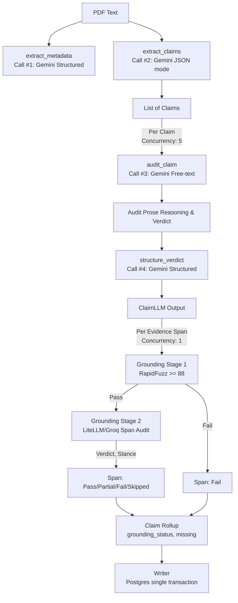

# Extraction, Audit, and Grounding Architecture

This document is the single source of truth for the claim extraction → audit → grounding pipeline, its prompt versioning, its eval methodology, and its known limitations. It reflects the current state of the codebase.

## 1. Pipeline Overview

The claim lifecycle flows from raw paper text through extraction, auditing, structuring, and finally grounding validation, before being written to Postgres.

## 2. Prompts & Versioning

The pipeline uses 4 distinct LLM calls for claims processing, plus 1 for span grounding.

### Call Sequence & Schema Enforcement
| Call | Purpose | Function | Output Format | Schema |
|---|---|---|---|---|
| #1 | Metadata | `extract_metadata()` | Structured | `response_schema=MetadataExtractionResponse` |
| #2 | Extractor | `extract_claims()` | JSON | JSON mode, NO `response_schema` |
| #3 | Auditor | `_audit_and_structure_claim()`| Free-text | No JSON, no schema |
| #4 | Structurer| `_audit_and_structure_claim()`| Structured | `response_schema=ClaimLLM` |

**Important distinction:** The extractor (Call #2) uses JSON mode (`response_mime_type="application/json"`) but intentionally omits `response_schema` to prevent field-ordering bias. The structurer (Call #4) is the only claims-pipeline call that uses `response_schema`.

### Prompt Version Hash
Prompt versioning is managed in [`extraction/prompt_version.py`](file:///H:/Work%20projects/Prism/Prism.PythonService/extraction/prompt_version.py). A 12-character SHA-256 hash is generated by concatenating the bytes of 8 prompt files in a fixed order:
1. `extract_metadata_system.md`
2. `extract_metadata_fewshot.json`
3. `extract_claims_system.md`
4. `extract_claims_fewshot.json`
5. `audit_claim_system.md`
6. `structure_verdict_system.md`
7. `audit_system.txt`
8. `audit_fewshot.json`

## 3. Grounding Mechanics

Grounding is a post-hoc validation step. It **never overrides** the auditor's label (`label` passes through unmodified). The pipeline is completely stable and acyclic.

### Stage 1: Lexical Match (RapidFuzz)
Each `EvidenceSpanLLM` quote is checked against the raw paper text using RapidFuzz (`fuzz.partial_ratio`). 
- **Threshold**: `RAPIDFUZZ_THRESHOLD = 88`
- Spans failing this gate get `grounding_status=GroundingStatus.FAIL` and `stance=None`. They do not proceed to Stage 2.

### Stage 2: Semantic Audit (LiteLLM)
Surviving spans are audited by an LLM via LiteLLM (Groq `gpt-oss-20b` primary, Gemini Flash Lite fallback).
- **Context Window**: Extracts 500-1500 chars surrounding the quote, snapping to paragraph boundaries (`\n\n`) or sentence boundaries (`. ` or `\n`).
- **Response**: `SpanAuditVerdict` with `reasoning`, `stance` (`supports`, `refutes`, `neutral`), `verdict` (`Pass`, `Partial`, `Fail`), and `reason`.
- **Concurrency**: Per-span audit is sequential (`AUDIT_CONCURRENCY = 1`).

### Claim Rollup Logic
The per-span verdicts roll up to a single claim status:
- If any span is `Pass`: `grounding_status = GroundingStatus.PASS`, `missing = False`
- Else if any span is `Partial`: `grounding_status = GroundingStatus.PARTIAL`, `missing = False`
- Else if any span is `Skipped` (transient LLM error): `grounding_status = GroundingStatus.SKIPPED`, `missing = False`
- Else (all spans `Fail`): `grounding_status = GroundingStatus.FAIL`, `missing = True`

## 4. Data Contracts

The architecture uses a two-layer Pydantic design to separate LLM outputs from final, grounding-aware entities in [`extraction/schemas.py`](file:///H:/Work%20projects/Prism/Prism.PythonService/extraction/schemas.py).

### LLM Layer
- `EvidenceSpanLLM`: Contains the raw quote. Enforces `min_length=1`. No grounding/stance fields.
- `ClaimLLM`: Output of Call #4. Contains `label` (`ClaimLabel` enum).
- `ClaimsExtractionResponse`, `MetadataExtractionResponse`.

### Final Layer
- `EvidenceSpanFinal`: Adds `grounding_status` and `stance`.
- `ClaimFinal`: Adds `grounding_status`, `missing`, and `reason`.
- `PaperMetadataFinal`.

### Postgres Display Status
- `effective_status`: A Postgres `GENERATED ALWAYS AS (...) STORED` column that provides a unified display status, structurally guaranteed not to drift from `label` and `missing`.

## 5. Eval Harness & Golden Set

The evaluation harness operates primarily in a secretless, offline mode for CI to avoid live LLM calls and API quota burn.

### Golden Sets
- `docs/evals/matrix_eval.json`: 3 papers, 37 expected claim rows (13 Reflexion, 12 CoT, 12 ReAct). 
- `docs/evals/matcher_gold.json`: 15 hand-authored gold pairs to calibrate the LLM judge.
- `docs/evals/golden_eval.json`: 21 questions across 3 papers.

### The Four Metrics (`eval/scorer.py`)
| Metric | Description |
|---|---|
| `refusal_rate` | (correct_refusals / total_negatives). The grounder correctly refused claims the paper doesn't support. |
| `strict_refusal_rate` | Same as refusal_rate, but requires exact `expected_label` match (no omission/grounding-rejection credit). |
| `positive_hits` | (count). The grounder correctly affirmed claims the paper does support. |
| `false_rejection_rate` | (false_rejections / positive_total). The grounder incorrectly refused claims the paper DOES support. |

**Thresholds:** `refusal_rate` must be >= `0.70`, and `positive_hits` must be >= `10`.

### Frozen-Fixture CI Pattern
CI uses `--source fixture` to read claims and matches already frozen into JSON fixtures (`docs/evals/fixtures/*.json`) by `dump_fixture.py`. The eval harness is fully offline in CI.

## 6. Developer Workflow: Fixture Regeneration

When `uv run python -m eval.check_fixture_freshness` fails, consult this table (from `RUNBOOK.md`) to resolve:

| Failure message contains | What changed | Fix |
|---|---|---|
| `prompt_hash ... does not match` / "extraction changed" | The extraction prompt files (`prompts/*.md`, `*.json`) changed | Full regen: `uv run python -m eval.dump_fixture --paper all`, then `uv run python -m eval.verify_matcher_gold` |
| `matcher_fingerprint ... does not match` / "matcher changed" | Only `LLM_EVAL_MATCHER_MODEL` / `LLM_EVAL_MATCHER_FALLBACK_MODEL` (or matcher prompt) changed | Re-match only: `uv run python -m eval.rematch_fixture --paper all`, then `uv run python -m eval.verify_matcher_gold` |
| `matcher_gold_pass_rate ... matcher gold check failed or never ran` | The matcher was never calibrated against `matcher_gold.json`, or a stale rate was cleared | Re-verify: `uv run python -m eval.verify_matcher_gold` |

*Gold-set pass floor is 0.9 (90%).*

## 7. Known Limitations

- **RapidFuzz vs table citations:** `RAPIDFUZZ_THRESHOLD = 88` may be too strict for table extractions which often lose layout or spacing during PDF parsing, causing valid tabular quotes to fail Stage 1 lexical matching.
- **Scope-checking bluntness:** The auditor uses generalized reasoning instructions to catch broad claims (generalization-without-test). It may sometimes struggle with subtle scope nuances in complex papers.
- **`stance: refutes` never observed:** [NOT VERIFIED - User Reported]. While the `stance` field supports "refutes", it has been reported that this is not observed populating in production extraction runs.
- **PDF ligature mojibake:** PyMuPDF extraction sometimes produces ligatures (fi, fl) that break exact string matching. *Mitigation:* `eval/matcher.py` uses `unicodedata.normalize("NFKC", text)` to decompose these for the matcher.
- **Held-out paper gap:** The golden set is heavily concentrated on 3 specific papers (Reflexion, CoT, ReAct). There is limited evaluation of performance on entirely held-out unseen domains.

## 8. FUTURE

- Improve RapidFuzz handling for flattened PDF tables.
- Consider multi-paper evaluation expansion to address the held-out paper gap.
- Implement consumption of the `stance` field in the UI or downstream aggregations.
- Investigate and resolve the `stance: refutes` observation gap.
